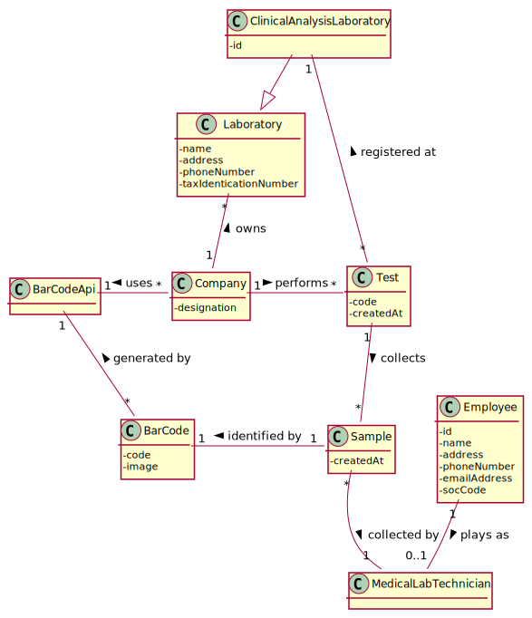
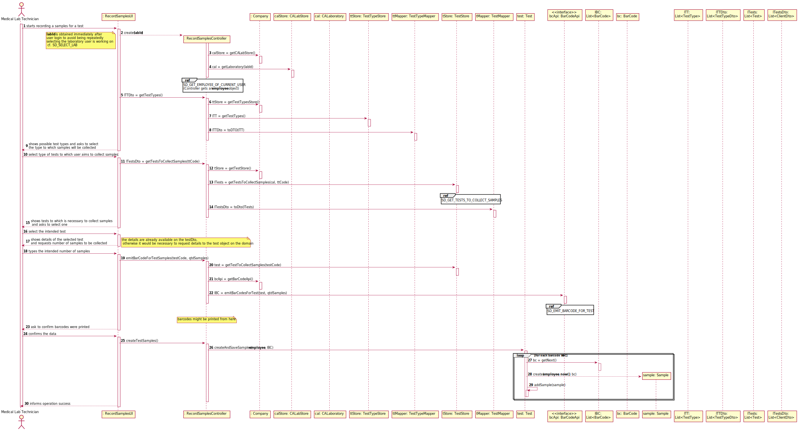
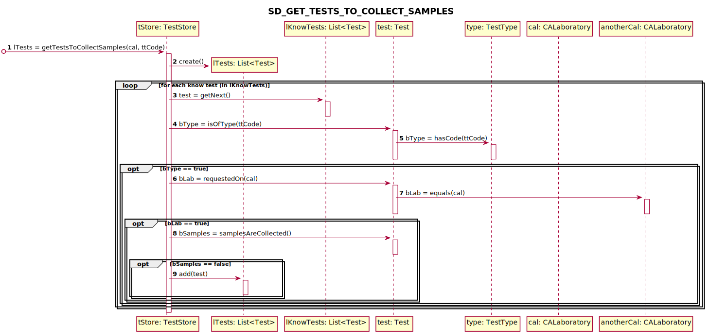
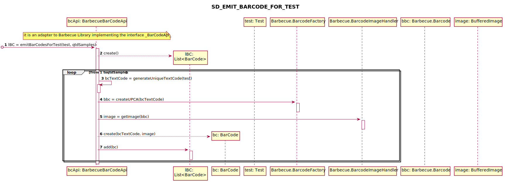

# US5 - To record samples for a given test

## 1. Requirements Engineering

### 1.1. User Story Description

As a medical lab technician, I want to record the samples collected in the scope of a given test.

### 1.2. Customer Specifications and Clarifications 

**Omitted / Not Provided.**
  
### 1.3. Acceptance Criteria

**Omitted / Not Provided.**

### 1.4. Found out Dependencies

**Omitted / Not Provided.**

### 1.5 Input and Output Data

**Omitted / Not Provided.**

### 1.6. System Sequence Diagram (SSD)

**Omitted / Not Provided.**

### 1.7 Other Relevant Remarks

**Omitted / Not Provided.**

## 2. OO Analysis

### 2.1. Relevant Domain Model Excerpt 

### 2.2. Other Remarks

**Omitted / Not Provided.**

## 3. Design - User Story Realization

### 3.1. Rationale

**Omitted / Not Provided.**

## 3.2. Sequence Diagram (SD)
  

**Remark 1:** The "_SD_SELECT_LAB_" is provide on US 4 folder

**Remark 2:** The "_SD_GET_EMPLOYEE_OF_CURRENT_USER_" is provide on US 4 folder
  
## 3.3. Class Diagram (CD)

**Omitted / Not Provided.**

# 4. Tests 

**Omitted**

# 5. Construction (Implementation)

**Omitted**

# 6. Integration and Demo 

**Omitted / Not Provided.**

# 7. Observations

**Omitted / Not Provided.**

