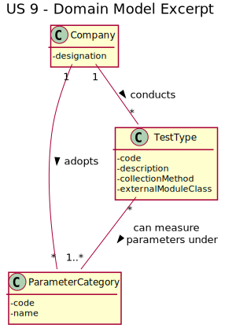
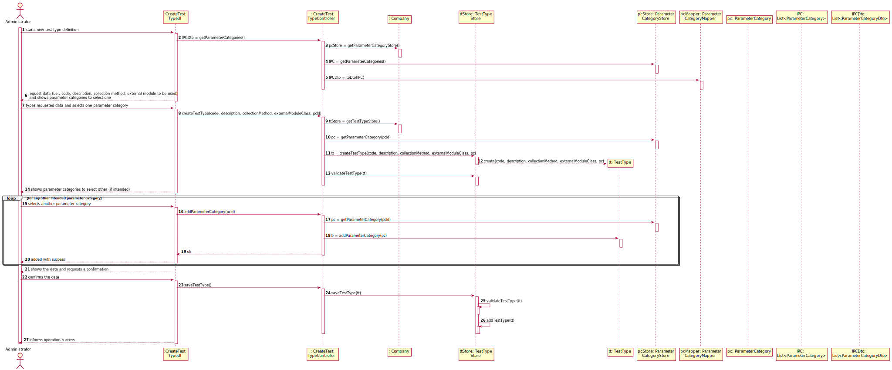

# US9 - To Specify a new Type of Test (_Updated From Sprint B to C_)

## 1. Requirements Engineering

### 1.1. User Story Description

As an administrator, I want to specify a new type of test and its collecting methods.

### 1.2. Customer Specifications and Clarifications 

 **Omitted / Not Provided.**

  
### 1.3. Acceptance Criteria

**Omitted / Not Provided.**

### 1.4. Found out Dependencies

**Omitted / Not Provided.**

### 1.5 Input and Output Data

**Omitted / Not Provided.**

### 1.6. System Sequence Diagram (SSD)

**Omitted / Not Provided.**

### 1.7 Other Relevant Remarks

**Omitted / Not Provided.**

## 2. OO Analysis

### 2.1. Relevant Domain Model Excerpt 

### 2.2. Other Remarks

**Omitted / Not Provided.**

## 3. Design - User Story Realization

### 3.1. Rationale

**Omitted / Not Provided.**

## 3.2. Sequence Diagram (SD)
  

  
## 3.3. Class Diagram (CD)

**Omitted / Not Provided.**

# 4. Tests 

**Omitted / Not Provided.**

# 5. Construction (Implementation)

**Omitted / Not Provided.**

# 6. Integration and Demo 

**Omitted / Not Provided.**

# 7. Observations

**Omitted / Not Provided.**

