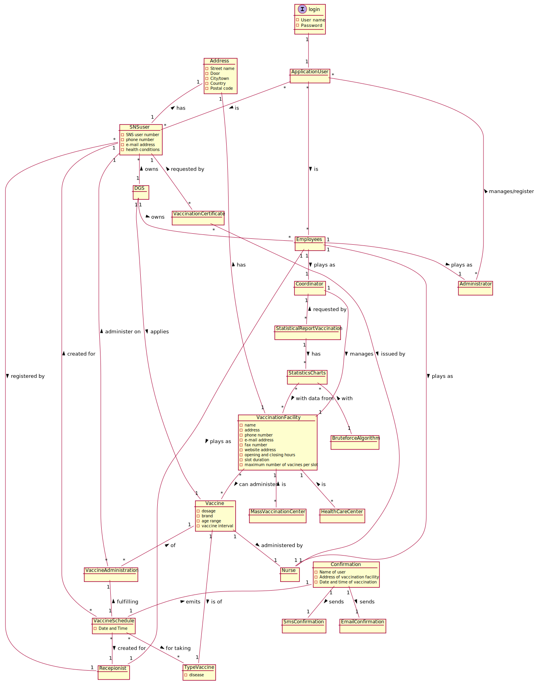

# OO Analysis #

The construction process of the domain model is based on the client specifications, especially the nouns (for _concepts_) and verbs (for _relations_) used. 

## Rationale to identify domain conceptual classes ##
To identify domain conceptual classes, start by making a list of candidate conceptual classes inspired by the list of categories suggested in the book "Applying UML and Patterns: An Introduction to Object-Oriented Analysis and Design and Iterative Development". 

### _Conceptual Class Category List_ ###

**Business Transactions**

* Vaccination Administration

---

**Transaction Line Items**

*

---

**Product/Service related to a Transaction or Transaction Line Item**

*  Vaccine

---

**Transaction Records**

*  Vaccination certificate

---  

**Roles of People or Organizations**

* SNS user
* Coordinator
* Nurse
* Receptionist
* Administrator 

---

**Places**

* Vaccination Center
* Health Care Center

---

**Noteworthy Events**

* Vaccine Schedule,
* Vaccine Administration
* Emission of certificate of vaccination
* Statistical data of vaccination

---

**Physical Objects**

* Vaccine

---

**Descriptions of Things**

*  Vaccine Type

---

**Catalogs**

*  Types of Vaccine

---

**Containers**

* TypesVaccine
* VaccineTypes

---

**Elements of Containers**

* VaccineTypes
* VaccineBrand

---

**Organizations**

* DGS
* AGES
* ARS

---

**Other External/Collaborating Systems**

* Emailing System
* SMS System

---

**Records of finance, work, contracts, legal matters**

* Reports of vaccination
* Statistical data of vaccination

---

**Financial Instruments**

*  

---

**Documents mentioned/used to perform some work/**

* SNS user,nurse data(identification number,phone )
---

###**Rationale to identify associations between conceptual classes**###

An association is a relationship between instances of objects that indicates a relevant connection and that is worth of remembering, or it is derivable from the List of Common Associations: 

+ **_A_** is physically or logically part of **_B_**
+ **_A_** is physically or logically contained in/on **_B_**
+ **_A_** is a description for **_B_**
+ **_A_** known/logged/recorded/reported/captured in **_B_**
+ **_A_** uses or manages or owns **_B_**
+ **_A_** is related with a transaction (item) of **_B_**
+ etc.

| Concept (A) 		                            | Association   	 |                               Concept (B) |
|-------------------------------------------|:---------------:|------------------------------------------:|
| DGES  	                                   |     manages     |                              ARS AGES |
| Coordinator                               |     part of     |                             ARS  AGES |
| Nurse Recepionist                     |     part of     | Health Care Center Vaccination Center |
| Health Care Center Vaccination Center |   managed by    |                              Coordinatior |
| VaccineType TypeVaccine               |   created by    |                             Administrator |
| TypeVaccine                               |       has       |                               VaccineType |
| Vaccine                                   |       has       |                               VaccineType |
| VaccineSchedule                           |   created by    |                  SNS user Recepionist |
|                                           |   for taking    |                               VaccineType |
| Statistical data of vaccination           |   ordered by    |                               Coordinator |
| Emission of certificate of vaccination    |    issued by    |                                     Nurse |
|                                           |    given to     |                                  SNS user |

## Domain Model

**Do NOT forget to identify concepts atributes too.**

**Insert below the Domain Model Diagram in a SVG format**

