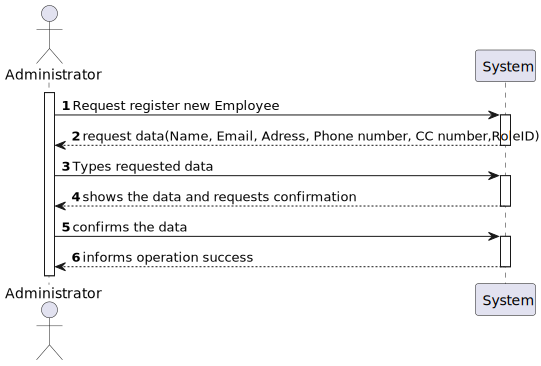
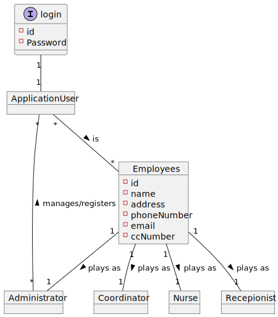
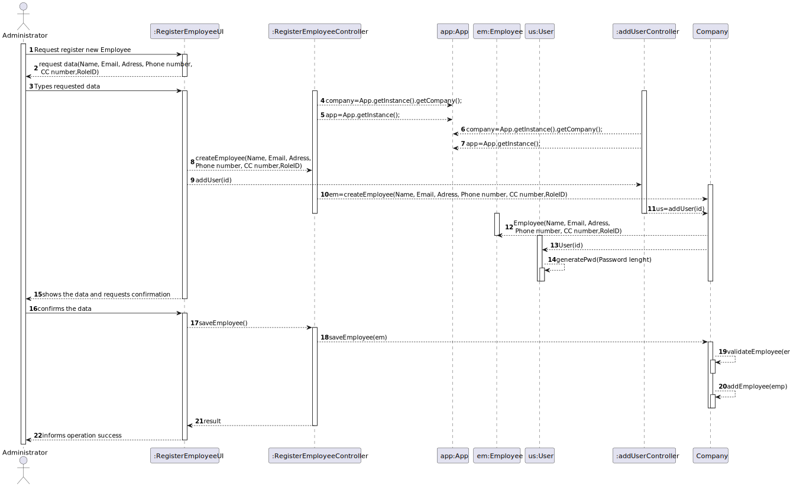

# US 010 - to register an Employee

## 1. Requirements Engineering

### 1.1. User Story Description

*As an administrator, I want to register an Employee.*

### 1.2. Customer Specifications and Clarifications 

*Insert here any related specification and/or clarification provided by the client together with **your interpretation**. When possible, provide a link to such specifications/clarifications.*

>- **Question:**
    -Does the employee's name have any character limits?
>- **Answer:** No

>- **Question:**
   -Should the password be entered by the administrator during the registration,if so by the admin or the worker, or should be generated automatically?
>- **Answer:** the password should be randomly generated.

>- **Question:**
   -How does the employee should receive his password?
>- **Answer:** 

>- **Question:**
   -In addition to the name, role, email and password, is there any other attribute needed for the employee??
>- **Answer:** Every Employee has only one role (Coordinator, Receptionist, Nurse).
   Employee attributes: Id (automatic), Name, address, phone number, e-mail and Citizen Card number.
   All attributes are mandatory.

>- **Question:**
   -Will it be possible to edit or delete the employee's data, after being registered in the system?
>- **Answer:**

### 1.3. Acceptance Criteria

**AC01-** Each user must have a single role defined in the system.\
**AC02-** Phone number must have 9 digits\
**AC03-** CC number must have 8 digits\
**AC04-**  the password should be randomly generated, holding seven alphanumeric characters, including three capital letters and two digits.

### 1.4. Found out Dependencies

*Identify here any found out dependency to other US and/or requirements.*

### 1.5 Input and Output Data
**Input Data:**\
**- Typed data:**

- id
- name
- email
- password
- address
- CC number
- phone number
- role id

**- Selected data:**

- name
- email
- address
-CC number
- phone number
- role id

**Output Data:**

- (In)Success of the operation

### 1.6. System Sequence Diagram (SSD)

*Insert here a SSD depicting the envisioned Actor-System interactions and throughout which data is inputted and outputted to fulfill the requirement. All interactions must be numbered.*

### 1.7 Other Relevant Remarks

There are some similarities to US 9 regarding the need to validate similar data, for exemple address and phone number. Thus needing to use the Validate class with methods to validate such data 
.
## 2. OO Analysis

### 2.1. Relevant Domain Model Excerpt 
*In this section, it is suggested to present an excerpt of the domain model that is seen as relevant to fulfill this requirement.* 

### 2.2. Other Remarks

*Use this section to capture some aditional notes/remarks that must be taken into consideration into the design activity. In some case, it might be usefull to add other analysis artifacts (e.g. activity or state diagrams).* 

## 3. Design - User Story Realization 

### 3.1. Rationale

**The rationale grounds on the SSD interactions and the identified input/output data.**

| Interaction ID | Question: Which class is responsible for...  | Answer                                           | Justification (with patterns)                                                                                    |
|:---------------|:---------------------------------------------|:-------------------------------------------------|:-----------------------------------------------------------------------------------------------------------------|
| Step 1  		     | 			... interacting with the actor?				       | RegisterEmployeeUI                               | **Pure Fabrication:** there is no reason to assign this responsibility to any existing class in the Domain Model |
|                | ..coordinating the US?                       | RegisterEmployeeController and AddUserController | **Controller**                                                                                                   |
| Step 2 		      | 							                                      |                                                  |                                                                                                                  |
| Step 3 		      | 		...saving the typed data?						            | Client                                           | **IE:** a Administrator knows all data                                                                            |
|                | ... instantiating a new Employee?            | Company                                          | **Creator** Company contais all (defined) Employees                                                              |
|                | ... instantiating a new User?                | Company                                          | **Creator** Company contais all (defined) Employees                                                              |
|                | ... validating all data (Employee and User)? | RegisterEmployeeUI                               | **IE:** knows all data of the Employee before instantiating a new Employee                                       |
|                | ... validating all data (global validation)? | Company                                          | **IE:** knows all the Employees and Users                                                                        |
| Step 4  		     | 		... generating the password?					          | User.generatePwd                                 | **IE** and **Pure Fabrication**: User has all the required information and means to generate the password (IE).  |
| Step 5  		     | 			... saving the Employee?				              | Company                                          | **IE:** Knows all Employees                                                                                      |
|                | ... saving the User?                         | Company                                          | **IE:** Knows all Users                                                                                          |
| Step 6  		     | 			... informing operation success?				      | RegisterEmployeesUI	                             | **IE:** is responsible for user interactions                                                                     |           

### Systematization ##

According to the taken rationale, the conceptual classes promoted to software classes are: 

 * Employee
 * Company
 * App
 * User

Other software classes (i.e. Pure Fabrication) identified: 
 * RegisterEmployeeUI  
 * RegisterEmployeeController
 * AddUserUI
 * AddUserController
 * Validate

## 3.2. Sequence Diagram (SD)

*In this section, it is suggested to present an UML dynamic view stating the sequence of domain related software objects' interactions that allows to fulfill the requirement.* 

## 3.3. Class Diagram (CD)

*In this section, it is suggested to present an UML static view representing the main domain related software classes that are involved in fulfilling the requirement as well as and their relations, attributes and methods.*

