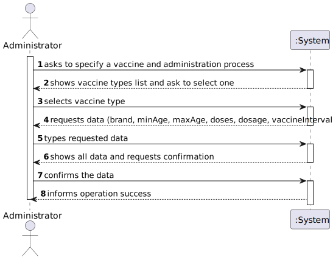
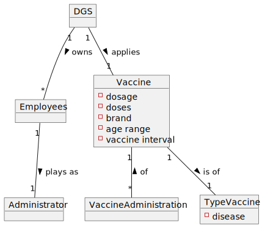

# US 013 - To specify a new vaccine and its administrative process

## 1. Requirements Engineering

*In this section, it is suggested to capture the requirement description and specifications as provided by the client as well as any further clarification on it. It is also suggested to capture the requirements acceptance criteria and existing dependencies to other requirements. At last, identify the involved input and output data and depicted an Actor-System interaction in order to fulfill the requirement.*

### 1.1. User Story Description

As an administrator, I intendo to specify a new vaccine and its adminintration process.

### 1.2. Customer Specifications and Clarifications 

**From the specifications document:**
>  [...] for each type of vaccine, several vaccines might exist, each one
demanding a distinct administration process. For instance, for the Covid-19 type, there is (i) the
Pfizer vaccine, (ii) the Moderna vaccine, (iii) the Astra Zeneca vaccine, and so on.

>   The vaccine administration process comprises (i) one or more age groups (e.g.: 5 to 12 years old, 13 to 18 years
old, greater than 18 years old), and (ii) per age group, the doses to be administered (e.g.: 1, 2, 3), the
vaccine dosage (e.g.: 30 ml), and the time interval regarding the previously administered dose.

**From the client calrifications:**
> - **Question:** Regarding the US13 (Specify a new vaccine and its administration process) is there more data that should be inserted besides the number of doses of the vaccine and the necessary time between doses?
> 
> - **Answer:** *Not yet provided*

> - **Question:** As to the interval between doses, what time format are we to use? (e.g. days, weeks, months)
>
> - **Answer:** *Not yet provided*
### 1.3. Acceptance Criteria

**Omitted/ Not Provided.**

### 1.4. Found out Dependencies

This US depends on US012 since a vaccine type needs to be already in the system in order to be given an administrative process.

### 1.5 Input and Output Data

- **Typed Data:**
  - vaccine brand
  - age group/ range
  - dosage
  - doses
  - interval between doses
  - disease

- **Output Data:**
  - (In)Success of the operation

### 1.6. System Sequence Diagram (SSD)

*Insert here a SSD depicting the envisioned Actor-System interactions and throughout which data is inputted and outputted to fulfill the requirement. All interactions must be numbered.*

### 1.7 Other Relevant Remarks

*Use this section to capture other relevant information that is related with this US such as (i) special requirements ; (ii) data and/or technology variations; (iii) how often this US is held.* 

## 2. OO Analysis

### 2.1. Relevant Domain Model Excerpt

### 2.2. Other Remarks

*Use this section to capture some aditional notes/remarks that must be taken into consideration into the design activity. In some case, it might be usefull to add other analysis artifacts (e.g. activity or state diagrams).* 

## 3. Design - User Story Realization 

### 3.1. Rationale

**The rationale grounds on the SSD interactions and the identified input/output data.**

| Interaction ID | Question: Which class is responsible for... | Answer  | Justification (with patterns)  |
|:-------------  |:--------------------- |:------------|:---------------------------- |
| Step 1  		 |							 |             |                              |
| Step 2  		 |							 |             |                              |
| Step 3  		 |							 |             |                              |
| Step 4  		 |							 |             |                              |
| Step 5  		 |							 |             |                              |
| Step 6  		 |							 |             |                              |              
| Step 7  		 |							 |             |                              |
| Step 8  		 |							 |             |                              |
| Step 9  		 |							 |             |                              |
| Step 10  		 |							 |             |                              |  

### Systematization ##

According to the taken rationale, the conceptual classes promoted to software classes are: 

 * Class1
 * Class2
 * Class3

Other software classes (i.e. Pure Fabrication) identified: 
 * xxxxUI  
 * xxxxController

## 3.2. Sequence Diagram (SD)

*In this section, it is suggested to present an UML dynamic view stating the sequence of domain related software objects' interactions that allows to fulfill the requirement.* 

## 3.3. Class Diagram (CD)

*In this section, it is suggested to present an UML static view representing the main domain related software classes that are involved in fulfilling the requirement as well as and their relations, attributes and methods.*

# 4. Tests 
*In this section, it is suggested to systematize how the tests were designed to allow a correct measurement of requirements fulfilling.* 

**_DO NOT COPY ALL DEVELOPED TESTS HERE_**

**Test 1:** Check that it is not possible to create an instance of the Example class with null values. 

	@Test(expected = IllegalArgumentException.class)
		public void ensureNullIsNotAllowed() {
		Exemplo instance = new Exemplo(null, null);
	}

*It is also recommended to organize this content by subsections.* 

# 5. Construction (Implementation)

*In this section, it is suggested to provide, if necessary, some evidence that the construction/implementation is in accordance with the previously carried out design. Furthermore, it is recommeded to mention/describe the existence of other relevant (e.g. configuration) files and highlight relevant commits.*

*It is also recommended to organize this content by subsections.* 

# 6. Integration and Demo 

*In this section, it is suggested to describe the efforts made to integrate this functionality with the other features of the system.*

# 7. Observations

*In this section, it is suggested to present a critical perspective on the developed work, pointing, for example, to other alternatives and or future related work.*

