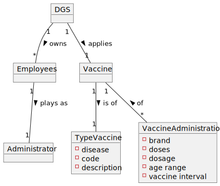
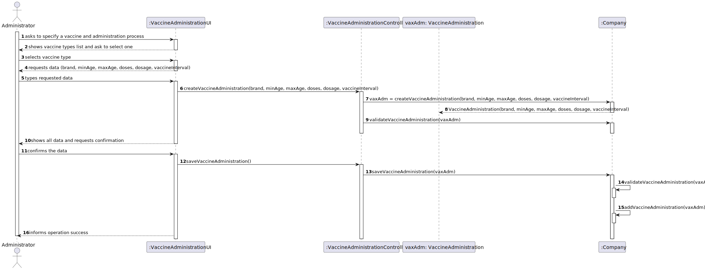
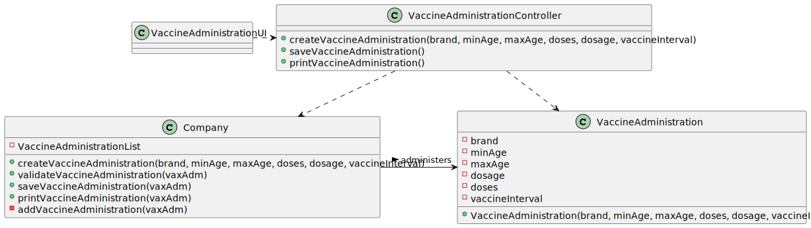

# US 013 - To specify a new vaccine and its administrative process

## 1. Requirements Engineering

*In this section, it is suggested to capture the requirement description and specifications as provided by the client as
well as any further clarification on it. It is also suggested to capture the requirements acceptance criteria and
existing dependencies to other requirements. At last, identify the involved input and output data and depicted an
Actor-System interaction in order to fulfill the requirement.*

### 1.1. User Story Description

As an administrator, I intendo to specify a new vaccine and its adminintration process.

### 1.2. Customer Specifications and Clarifications

**From the specifications document:**
> [...] for each type of vaccine, several vaccines might exist, each one
> demanding a distinct administration process. For instance, for the Covid-19 type, there is (i) the
> Pfizer vaccine, (ii) the Moderna vaccine, (iii) the Astra Zeneca vaccine, and so on.

> The vaccine administration process comprises (i) one or more age groups (e.g.: 5 to 12 years old, 13 to 18 years
> old, greater than 18 years old), and (ii) per age group, the doses to be administered (e.g.: 1, 2, 3), the
> vaccine dosage (e.g.: 30 ml), and the time interval regarding the previously administered dose.

**From the client calrifications:**
> - **Question:** Regarding the US13 (Specify a new vaccine and its administration process) is there more data that
    should be inserted besides the number of doses of the vaccine and the necessary time between doses?
>
> - **Answer:** *Not yet provided*

> - **Question:** As to the interval between doses, what time format are we to use? (e.g. days, weeks, months)
>
> - **Answer:** Number of days.

### 1.3. Acceptance Criteria

**Omitted/ Not Provided.**

### 1.4. Found out Dependencies

This US depends on US012 since a vaccine type needs to be already in the system in order to be given an administrative
process.

### 1.5 Input and Output Data

- **Typed Data:**
    - vaccine brand
    - age group/ range
    - dosage
    - doses
    - interval between doses

- **Output Data:**
    - (In)Success of the operation

### 1.6. System Sequence Diagram (SSD)

### 1.7 Other Relevant Remarks

*Use this section to capture other relevant information that is related with this US such as (i) special requirements
; (ii) data and/or technology variations; (iii) how often this US is held.*

## 2. OO Analysis

### 2.1. Relevant Domain Model Excerpt

## 3. Design - User Story Realization

### 3.1. Rationale

**The rationale grounds on the SSD interactions and the identified input/output data.**

| Interaction ID    | Question: Which class is responsible for...      | Answer                          | Justification (with patterns)                                                                                 |
|:------------------|:-------------------------------------------------|:--------------------------------|:--------------------------------------------------------------------------------------------------------------|
| Step 1            | ... interacting with the actor?                  | VaccineAdministrationUI         | Pure Fabrication: there is no reason to assign this responsibility to any existing class in the Domain Model. |
|                   | ... coordinating the US?                         | VaccineAdministrationController | Controller                                                                                                    |
| Step 2            | 							                        |                                 |                                                                                                               |
| Step 3            | 							                        |                                 |                                                                                                               |
| Step 4            | n/a                                              |                                 |                                                                                                               |
| Step 5            | ... saving the input data?                       | VaccineAdministration           | IE: the object created in step 1 has its own data.                                                            |
|                   | ... instantiting a new Vaccine Administration?   | Company                         |                                                                                                               |
| Step 6            | ... validating the data locally?                 | VaccineAdministration           | IE: knows its own data.                                                                                       |
|                   | ... validating the data globally?                | Company                         | IE: knows all the VaccineAdministration objects.                                                              |
| Step 7            | ... saving the created vaccine administration?   | Company                         | IE: adopts/records all the VaccineAdministration objects.                                                     |
| Step 8            | ... informing the operation success?             | VaccineAdministrationUI         | IE: responsible for user interaction.                                                                         |

### Systematization ##

According to the taken rationale, the conceptual classes promoted to software classes are:

* VaccineAdministration
* Company

Other software classes (i.e. Pure Fabrication) identified:

* VaccineAdministrationUI (applying the "pure fabrication" pattern)
* VaccineAdministrationController (applying the "controller"pattern)

## 3.2. Sequence Diagram (SD)

## 3.3. Class Diagram (CD)

*In this section, it is suggested to present an UML static view representing the main domain related software classes
that are involved in fulfilling the requirement as well as and their relations, attributes and methods.*

