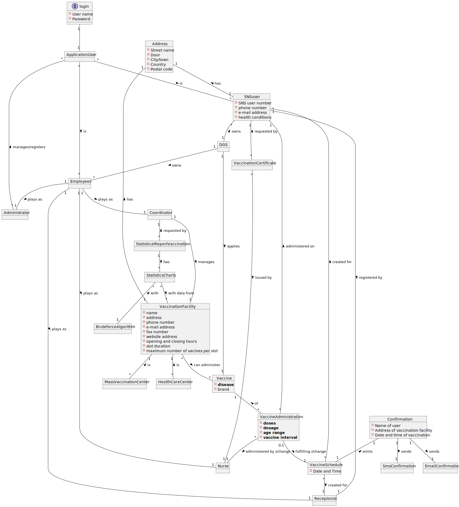

# OO Analysis #

The construction process of the domain model is based on the client specifications, especially the nouns (for _concepts_) and verbs (for _relations_) used. 

## Rationale to identify domain conceptual classes ##
To identify domain conceptual classes, start by making a list of candidate conceptual classes inspired by the list of categories suggested in the book "Applying UML and Patterns: An Introduction to Object-Oriented Analysis and Design and Iterative Development". 

### _Conceptual Class Category List_ ###

**Business Transactions**

* Vaccination Administration

---

**Transaction Line Items**

*

---

**Product/Service related to a Transaction or Transaction Line Item**

*  Vaccine

---

**Transaction Records**

*  Vaccination certificate

---  

**Roles of People or Organizations**

* SNS user
* Coordinator
* Nurse
* Receptionist
* Administrator 
* Employees
* Application User
* 

---

**Places**

* Vaccination Facility
* Mass Vaccination Center
* Health Care Center

---

**Noteworthy Events**

* Vaccine Schedule
* Vaccine Administration
* Emission of certificate of vaccination
* Statistical data of vaccinationº
* Login

---

**Physical Objects**

* Vaccine

---

**Descriptions of Things**

* Vaccine Brand
* Statistical Report of Vaccination

---

**Catalogs**

*  Types of Vaccine

---

**Containers**

* Types of Vaccine
* Vaccine
* Address
* Login

---

**Elements of Containers**

* Vaccine Types
* Vaccine Brand
* Dosage of vaccine
* Elements of a address
* Login credentials

---

**Organizations**

* DGS
* AGES
* ARS

---

**Other External/Collaborating Systems**

* Emailing System
* SMS System

---

**Records of finance, work, contracts, legal matters**

* Reports of vaccination
* Statistical data of vaccination

---

**Financial Instruments**

*  

---

**Documents mentioned/used to perform some work/**

* SNS user data (identification number, cellphone number,...)
* Vaccination Facility info (address, opening hours, phone number,...)
---

###**Rationale to identify associations between conceptual classes**###

An association is a relationship between instances of objects that indicates a relevant connection and that is worth of remembering, or it is derivable from the List of Common Associations: 

+ **_A_** is physically or logically part of **_B_**
+ **_A_** is physically or logically contained in/on **_B_**
+ **_A_** is a description for **_B_**
+ **_A_** known/logged/recorded/reported/captured in **_B_**
+ **_A_** uses or manages or owns **_B_**
+ **_A_** is related with a transaction (item) of **_B_**
+ etc.

| Concept (A) 		                                |  Association   	  |                                          Concept (B) |
|-----------------------------------------------|:-----------------:|-----------------------------------------------------:|
| Application User   	                          |        is         |                              Employees   SNS user |
| Administrator                                 | manages/registers |                                     Application User |
| DGS                                           |       owns        |                                 SNSuser Employees |
| DGS                                           |      applies      |                                              Vaccine |
| Employees                                     |     plays as      | Recepionist Nurse Coordinator Administrator |
| Vaccination Facility SNS user              |        has        |                                              Address |
| Vaccination Certificate                       |   requested by    |                                             SNS user |
| Coordinator                                   |      manages      |                                 Vaccination Facility |
| Mass Vaccination Center Health Care Center |        is         |                                 Vaccination Facility |
| Statistical Report Vaccination                |   requested by    |                                          Coordinator |
| Statistical Report Vaccination                |        has        |                                  Stastistical Charts |
| Statiscs Charts                               |       with        |                                Brute force Algorithm |
| Statiscs Chats                                |  with data from   |                                 Vaccination Facility |
| Vaccination Facility                          |  can administer   |                                              Vaccine |
| Vaccine Schedule                              |    created for    |                              SNS user Recepionist |
| Vaccine Schedule                              |    for taking     |                                         Type Vaccine |
| Vaccine                                       |        by         |                                                Nurse |
| Vaccine Administration                        |        of         |                                              Vaccine |
| Vaccine                                       |       is of       |                                      Type of Vaccine |
| SNS user                                      |   registered by   |                                          Recepionist |
| Vaccine Administration                        |  administered on  |                                             SNS user |
| Vaccine Administration                        |    fulfilling     |                                     Vaccine Schedule |
| Vaccine Certificate                           |     issued by     |                                                nurse |
| Vaccine Schedule                              |       emits       |                                         Confirmation |
| Confirmation                                  |       sends       |                                     SMS confirmation |
| Confirmation                                  |       sends       |                                  E-mail confirmation |

## Domain Model

**Do NOT forget to identify concepts atributes too.**

**Insert below the Domain Model Diagram in a SVG format**

