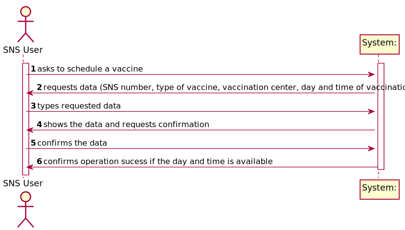

# US001 -To Schedule a vaccine

## 1. Requirements Engineering

### 1.1. User Story Description

As a SNS user, I intend to use the application to schedule a vaccine.

### 1.2. Customer Specifications and Clarifications

**From Project Description document**

>To take a vaccine, the SNS user should use the application to schedule his/her vaccination. The user
should introduce his/her SNS user number, select the vaccination center, the date, and the time (s)he
wants to be vaccinated as well as the type of vaccine to be administered (by default, the system
suggests the one related to the ongoing outbreak).

**From the Client Clarifications**

> Dear Client, in order to schedule a vaccine, the SNS user should:
introduce his/her SNS user number;
select the vaccination center;
select the date and time;
select the type of vaccine to be administered.
Related to 2): how should the SNS user know which vaccination centers are available on the app? From my point of view, the SNS user should be able to choose from a list of available vaccination centers, which were previously inserted on the system. Could you validate if this is the approach you are looking for?
> 
> **Answer**: Not Yet Provided
> 
> Group 74

### 1.3. Acceptance Criteria

**AC01-** A SNS User cannot schedule the same vaccine more than once

### 1.4. Found out Dependencies

* There is a dependency to "US03 Register a SNS user" since, in order to schedule a vaccine, you must be a registered SNS user.
* There is a dependency to "US09 Register a vaccination center to respond to a certain
  pandemic" since there must be vaccination centers for the scheduling of vaccines.

### 1.5 Input and Output Data

* Typed data:
  * SNS Number

* Selected data:
  * Vaccine Type
  * Vaccination Center
  * Day and Time of vaccination

### 1.6. System Sequence Diagram (SSD)

## 2. OO Analysis

### 2.1. Relevant Domain Model Excerpt

## 3. Design - User Story Realization

### 3.1. Rationale

**The rationale grounds on the SSD interactions and the identified input/output data.**

| Interaction ID | Question: Which class is responsible for... | Answer  | Justification (with patterns)  |
|:-------------  |:--------------------- |:------------|:---------------------------- |
| Step 1  		 |	...interacting with the actor?						 |  ScheduleVaccinationUI   | Pure Fabrication: there is no reason to assign this responsibility to any existing class in the Domain Model.|
|                              |...coordinating the US? | VaccinationScheduleController| Controller
| Step 2  		 |							 |             |                              |
| Step 3  		 |	... saving the input data?						 |  VaccinationScheduleController           |       Controller
| |...validating data? | VaccinationScheduleController | Controller
| Step 4  		 |							 |             |                              |
| Step 5  		 |	... saving the created vaccine schedule?						 |  Company           |    IE: adopts/records all the VaccinationAppointment objects.                          |
| Step 6  		 |							 |             |                              |

## 3.2. Sequence Diagram (SD)

*In this section, it is suggested to present an UML dynamic view stating the sequence of domain related software objects' interactions that allows to fulfill the requirement.*

## 3.3. Class Diagram (CD)

*In this section, it is suggested to present an UML static view representing the main domain related software classes that are involved in fulfilling the requirement as well as and their relations, attributes and methods.*

