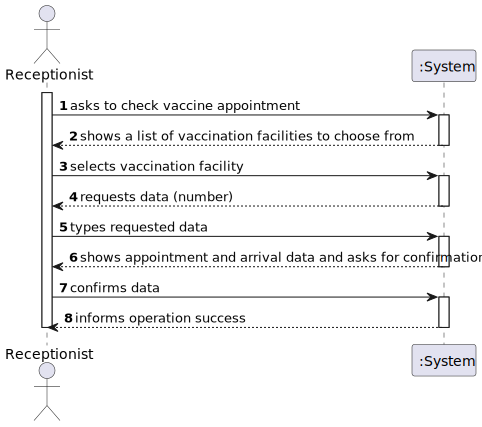
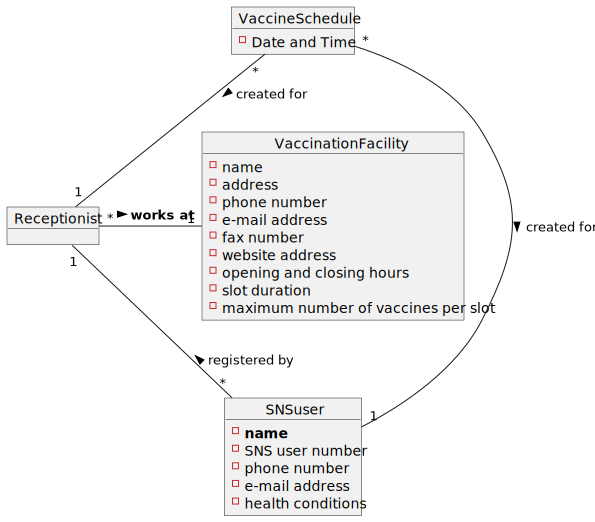

# US 004 - to register the arrival of an SNS user to take the vaccine

## 1. Requirements Engineering

### 1.1. User Story Description

As a receptionist at a vaccination center, I want to register the arrival of an SNS user
to take the vaccine.

### 1.2. Customer Specifications and Clarifications 

**From the specifications document:**

>[..] The receptionist asks the SNS user for his/her SNS user number and
confirms that he/she has the vaccine scheduled for the that day and time. If the information is
correct, the receptionist acknowledges the system that the user is ready to take the vaccine. Then,
the receptionist should send the SNS user to a waiting room where (s)he should wait for his/her
time.

**From the client clarification:**

>**Question:** How early/late can a user get to the vaccination center in order to be eligible to take the vaccine?
>Example: If a user has an appointment scheduled to 4PM, it does not make sense to be eligible if he tries to check in at 11AM. How long is this time limit?
>
> **Answer:** _Not Yet Provided._
> 
> (_Group 41_)

>**Question:** What are the attributes needed in order to register the arrival of an SNS user to a vaccination center?
> 
> **Answer:** The time of arrival should be registered.
> 
> (_Group 63_)
 
>**Question:** Should a receptionist register the arrival of an SNS user immediately when he arrives at the vaccination center or only after the receptionist confirms that the respective user has a vaccine schedule for that day and time?
> 
> **Answer:** The receptionist registers the arrival of a SNS user only after confirming that the user has a vaccine scheduled for that day and time.
> 
> (_Group 63_)

>**Question:** When the SNS user number is introduced by the receptionist and the system has no appointment for that SNS user number, how should the system proceed?
> 
> **Answer:** The application should present a message saying that the SNS user did not schedule a vaccination.
> 
> (_Group 10_)

>**Question:** What's the capacity of the waiting room?
>
>**Answer**: The waiting room will not be registered or defined in the system. The waiting room of each vaccination center has the capacity to receive all users who take the vaccine on given slot.
> 
> (_Group --_)

>**Question:** Respectively to US04, after the receptionist registers the SNS User's arrival at the Vaccination Center, the system creates the list that will be available for the Nurse to view, correct?
>
>**Answer:** The nurse checks the list (of SNS users in the waiting room) in US05.
> 
> (_Group 07_)

### 1.3. Acceptance Criteria

**AC01:** No duplicate entries should be possible for the same SNS user on the same day or vaccine period.

### 1.4. Found out Dependencies

This US depends on US001 since an SNS User must have scheduled a vaccination in order for it to be verified by the receptionist.

### 1.5 Input and Output Data

- **Typed Data**
  - SNS User number

- **Output Data**
  - Verification of (in)existing vaccination "appointment".

### 1.6. System Sequence Diagram (SSD)

*Insert here a SSD depicting the envisioned Actor-System interactions and throughout which data is inputted and outputted to fulfill the requirement. All interactions must be numbered.*

### 1.7 Other Relevant Remarks

*Use this section to capture other relevant information that is related with this US such as (i) special requirements ; (ii) data and/or technology variations; (iii) how often this US is held.* 

## 2. OO Analysis

### 2.1. Relevant Domain Model Excerpt 
*In this section, it is suggested to present an excerpt of the domain model that is seen as relevant to fulfill this requirement.* 

### 2.2. Other Remarks

*Use this section to capture some additional notes/remarks that must be taken into consideration into the design activity. In some case, it might be useful to add other analysis artifacts (e.g. activity or state diagrams).* 

## 3. Design - User Story Realization 

### 3.1. Rationale

**The rationale grounds on the SSD interactions and the identified input/output data.**

| Interaction ID | Question: Which class is responsible for... | Answer | Justification (with patterns) |
|:--------------|:--------------------------------------------|:-------|:------------------------------|
| Step 1  		    | 							                                     |        |                               |
| Step 2  		    | 							                                     |        |                               |
| Step 3  		    | 							                                     |        |                               |
| Step 4  		    | 							                                     |        |                               |
| Step 5  		    | 							                                     |        |                               |
| Step 6  		    | 							                                     |        |                               |              
| Step 7  		    | 							                                     |        |                               |
| Step 8  		    | 							                                     |        |                               |
| Step 9  		    | 							                                     |        |                               |
| Step 10  		   | 							                                     |        |                               |  

### Systematization ##

According to the taken rationale, the conceptual classes promoted to software classes are: 

 * Class1
 * Class2
 * Class3

Other software classes (i.e. Pure Fabrication) identified: 
 * xxxxUI  
 * xxxxController

## 3.2. Sequence Diagram (SD)

*In this section, it is suggested to present a UML dynamic view stating the sequence of domain related software objects' interactions that allows to fulfill the requirement.* 

## 3.3. Class Diagram (CD)

*In this section, it is suggested to present a UML static view representing the main domain related software classes that are involved in fulfilling the requirement as well as and their relations, attributes and methods.*

# 4. Tests 
*In this section, it is suggested to systematize how the tests were designed to allow a correct measurement of requirements fulfilling.* 

**_DO NOT COPY ALL DEVELOPED TESTS HERE_**

**Test 1:** Check that it is not possible to create an instance of the Example class with null values. 

	@Test(expected = IllegalArgumentException.class)
		public void ensureNullIsNotAllowed() {
		Exemplo instance = new Exemplo(null, null);
	}

*It is also recommended to organize this content by subsections.* 

# 5. Construction (Implementation)

*In this section, it is suggested to provide, if necessary, some evidence that the construction/implementation is in accordance with the previously carried out design. Furthermore, it is recommended to mention/describe the existence of other relevant (e.g. configuration) files and highlight relevant commits.*

*It is also recommended to organize this content by subsections.* 

# 6. Integration and Demo 

*In this section, it is suggested to describe the efforts made to integrate this functionality with the other features of the system.*

# 7. Observations

*In this section, it is suggested to present a critical perspective on the developed work, pointing, for example, to other alternatives and or future related work.*

