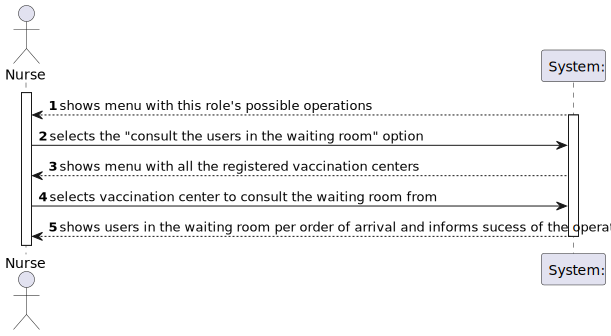
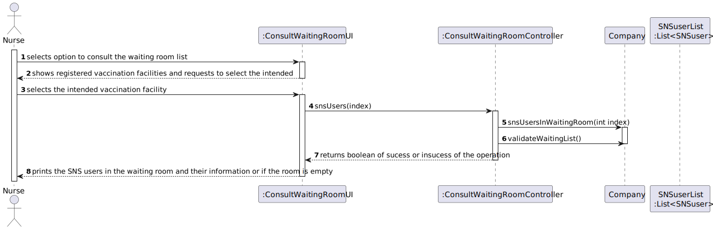

# US005 - Consult the users in the waiting room of a vacination center.

## 1. Requirements Engineering

### 1.1. User Story Description

As a nurse, I intend to consult the users in the waiting room of a vacination center.

### 1.2. Customer Specifications and Clarifications

> **Question**: "Regarding US 05, what does consulting constitute in this context? Does it refer only to seeing who is present and deciding who gets the vaccine or is checking the user info to administer the vaccine, registering the process, and sending it to the recovery room also part of this US?"
>
> **Answer**: The goal is to check the list of users that are waiting and ready to take the vaccine.

> **Question**: "I would like to know which are the attributes of the waiting room."
> 
> **Answer**: The waiting room will not be registered or defined in the system. The waiting room of each vaccination center has the capacity to receive all users who take the vaccine on given slot.

> **Question**: "We need to know if the nurse have to chose the vaccination center before executing the list or if that information comes from employee file?"
>
> **Answer**: When the nurse starts to use the application, firstly, the nurse should select the vaccination center where she his working. The nurse wants to check the list of SNS users that are waiting in the vaccination center where she his working.

> **Question**: "What information about the Users (name, SNS number, etc) should the system display when listing them?"
> 
> **Answer**: Name, Sex, Birth Date, SNS User Number and Phone Number.

### 1.3. Acceptance Criteria

* SNS Users’ list should be presented by order of arrival.

### 1.4. Found out Dependencies

* There is a dependency to "US004 Register the arrival of a SNS user
  to take the vaccine" since the registration of their arrival must be done beforehand consulting the waiting room.
* There is a dependency to "US009 Register a vaccination center to respond to a certain
  pandemic" since there must be registered vaccination centers in order to consult the waiting room from
### 1.5 Input and Output Data

**Input data:**

* Typed data:
  * None
* Selected data:
  * Operation selected (consulting the waiting room)
  * Vaccination facility

**Output data:**

* List of users in the waiting room
* Sucess or insucess of the operation

### 1.6. System Sequence Diagram (SSD)

### 1.7 Other Relevant Remarks

* None

## 2. OO Analysis

### 2.1. Relevant Domain Model Excerpt

### 2.2. Other Remarks

* None

## 3. Design - User Story Realization

### 3.1. Rationale

**The rationale grounds on the SSD interactions and the identified input/output data.**

| Interaction ID | Question: Which class is responsible for...                           | Answer                       | Justification (with patterns)                                                                                     |
|:---------------|:----------------------------------------------------------------------|:-----------------------------|:------------------------------------------------------------------------------------------------------------------|
| Step 1  		     | 		... interacting with the actor?					                                | ConsultWaitingRoomUI         | **Pure Fabrication**: there is no reason to assign this responsibility to any existing class in the Domain Model  |
|                | ... coordinating the US?                                              | ConsultWaitingRoomController | **Controller**                                                                                                    |
| Step 2  		     | 						                                                                |                              |                                                                                                                   |
| Step 3  		     | 		... printing the menu of vaccination facilities to chose from?					 | ConsultWaitingRoomUI         | **IE**: is responsible for user interactions                                                                      |
| Step 4         | ...saving the selected data?                                          | ConsultWaitingRoomUI         | **Pure Fabrication**:  there is no reason to assign this responsibility to any existing class in the Domain Model |
| Step 5  		     | 		... validating the users in the waiting room?					                  | Company                      | **IE**: knows all SNS users                                                                                       | 
|                | ... printing the waiting room list and informing operation success?   | ConsultWaitingRoomUI         | **IE**: is responsible for user interactions                                                                      |

### Systematization ##

According to the taken rationale, the conceptual classes promoted to software classes are:

* ConsultWaitingRoomUI
* Company

Other software classes (i.e. Pure Fabrication) identified:

* ConsultWaitingRoomUI
* ConsultWaitingRoomController

## 3.2. Sequence Diagram (SD)

## 3.3. Class Diagram (CD)

