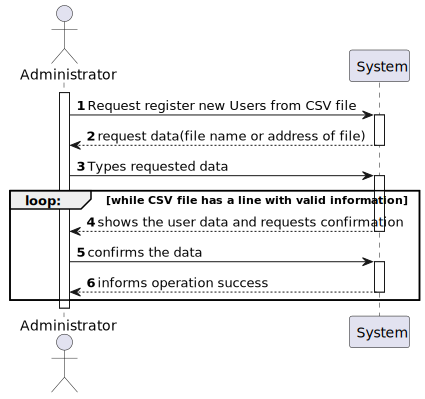
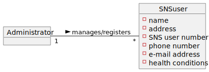
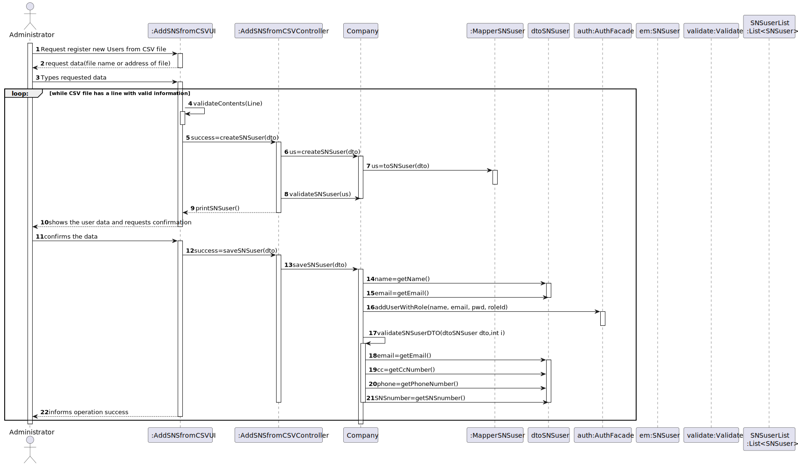
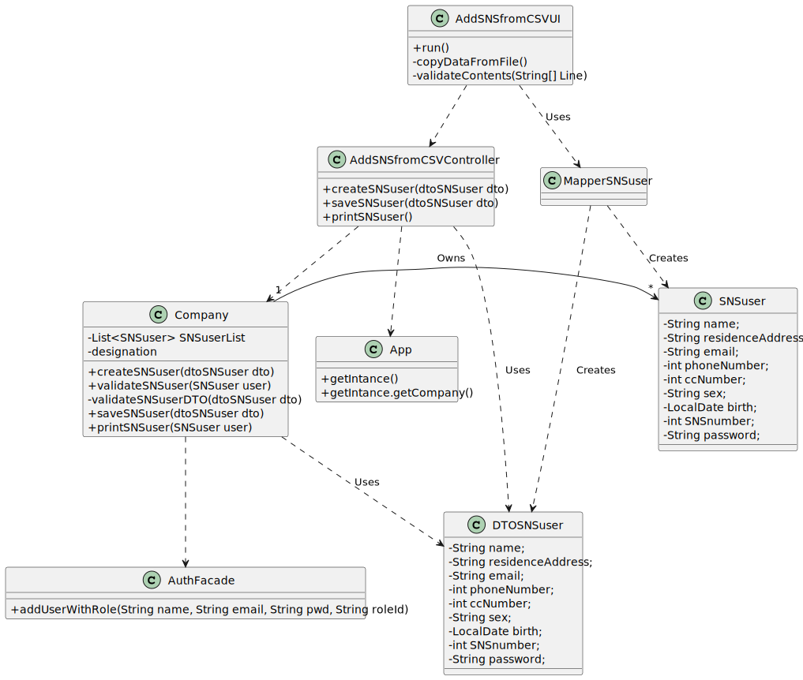

# US 014 - to load a set of users from a CSV file

## 1. Requirements Engineering

### 1.1. User Story Description

*As an administrator, I want to load a set of users from a CSV file*

### 1.2. Customer Specifications and Clarifications 

*Insert here any related specification and/or clarification provided by the client together with **your interpretation**. When possible, provide a link to such specifications/clarifications.*

**From Project Description document**

>An **Administrator is responsible for properly configuring and managing the core information** (e.g.:
type of vaccines, vaccines, vaccination centers, employees) required for this application to be
**operated daily by SNS users**, nurses, receptionists, etc.
> 

>The DGS has **Administrators** who administer the application. Any Administrator uses the
application to **register centers, SNS users**, center coordinators, receptionists, and nurses enrolled in
the vaccination process.
> 
 

**From Client Forum - Requirements Clarification**

>- **Question:**
    -the CSV file only contains information about SNS users of if the CSV file may also contain some information about employees from that vaccination center.
>- **Answer:** The CSV file only contains information about SNS users

>- **Question:**
   -When the admin wants to upload a CSV file to be read, should the file be stored at a specific location on the computer (e.g. the desktop) or should the admin be able to choose the file he wants to upload in a file explorer?"
>- **Answer:** The Administrator should write the file path.

>- **Question:**
   -What would be the sequence of parameters to be read on the CSV?
>- **Answer**  Name, Sex, Birth Date, Address, Phone Number, E-mail, SNS User Number and Citizen Card Number.

>- **Question**
    Also I would like to ask if there is any restrictions to the client age and what is the format of the Birth Date and the length of the phone number, citizen card number, and the SNS User number."
>- **Answer** 
-The dates registered in the system should follow the Portuguese format (dd/mm/yyyy). Regarding the other attributes, please study the concepts and define appropriate formats for the attributes.

>- **Question**
-Can the SNS User change the password?
>- **Answer** No. 

>- **Question**
-Should the new SNS User receive a message/notification that the registry got successfully completed?\
>- **Answer** 
-Yes.

>- **Question**
-On the last meeting you said that header contains names of the attributes that are listed in the file. My question is what is the delimiter for the header? Does it have points between words, commas or something else? 
>- **Answer**
-Each type of CSV file has only one delimiter character.\
   Acceptance criteria for US14: \
 The application must support importing two types of CSV files: \
a) one type must have a header, column separation is done using “;” character; \
b) the other type does not have a header, column separation is done using “,” character.

>- **Question**
-What should the system do if the file to be loaded has information that is repeated? For example, if there are 5 lines that have the same information or that have the same attribute, like the phone number, should the whole file be discarded?\
>- **Answer**
-If the file does not have other errors, all records should be used to register users. The business rules will be used to decide if all file records will be used to register a user.
For instance, if all users in the CSV file are already registered in system, the file should be processed normally but no user will be added to the system (because the users are already in the system).

>- **Question**
-Are there any SNS User attributes that can be omitted?\
>- **Answer**
-The Sex attribute is optional (it can also take the NA value). All other fields are required. 

>- **Question**
-How should the admin receive the login data/passwords for all registered users?
>- **Answer** 
-During this sprint, login and password data should be presented in the console application.
 In US14 the application is used to register a batch of users. For each user, all the data required to register a user should be presented in the console. 

### 1.3. Acceptance Criteria

**AC01-** Each user must have a single role defined in the system.\
**AC02-**  All input fields are required except sex.\
**AC03-** Phone number must have 9 digits\
**AC04-** CC number must have 8 digits\
**AC05-** SNS number must have 9 digits\
**AC06-** Sex is the only optional atribute\
**AC07-** The application must support importing two types of CSV
files:\
a) one type must have a header, column separation is done using “;”
character;\
b) the other type does not have a header, column separation is done
using “,” character.\
**AC08-** The E-mail, Phone Number, Citizen Card Number and SNS User Number should be unique for each SNS user.\
**AC09-** The SNS user must become a system user. The "auth"
component available on the repository must be reused (without modifications)\
**AC10-** The password should be randomly generated. It should have 7 alphanumeric characters, including three capital letters and two digits.\
**AC11-** Birth day must have the format: DD/MM/YYYY
### 1.4. Found out Dependencies

*Identify here any found out dependency to other US and/or requirements.*

- No dependencies were found

### 1.5 Input and Output Data
**Input Data:**\
**- Typed data:**
- file address
- name
- sex
- birthdate
- email
- address
- citizen card number
- SNS user Number
- phone number

**- Selected data:**

- SNS user role for login credentials 

**Output Data:**

- Saved list of SNS users
- (In)Success of the operation

### 1.6. System Sequence Diagram (SSD)

*Insert here a SSD depicting the envisioned Actor-System interactions and throughout which data is inputted and outputted to fulfill the requirement. All interactions must be numbered.*

 

### 1.7 Other Relevant Remarks

There are some similarities to US 9 regarding the need to validate similar data, for exemple address and phone number. Thus needing to use the Validate class with methods to validate such data 
.
## 2. OO Analysis

### 2.1. Relevant Domain Model Excerpt 
*In this section, it is suggested to present an excerpt of the domain model that is seen as relevant to fulfill this requirement.* 

 

### 2.2. Other Remarks

-Similar feature, only difference is in this case the user doesn't type the data of the SNS user on the console.\
-There are some similarities to US 3 and US 10 regarding the need to generate a password.
## 3. Design - User Story Realization 

### 3.1. Rationale

**The rationale grounds on the SSD interactions and the identified input/output data.**

| Interaction ID | Question: Which class is responsible for...                    | Answer                  | Justification (with patterns)                                                                                                                                                                                                                                                    |
|:---------------|:---------------------------------------------------------------|:------------------------|:---------------------------------------------------------------------------------------------------------------------------------------------------------------------------------------------------------------------------------------------------------------------------------|
| Step 1  		     | 			... interacting with the actor?				                         | AddSNSfromCSVUI         | **Pure Fabrication:** there is no reason to assign this responsibility to any existing class in the Domain Model                                                                                                                                                                 |
|                | ..coordinating the US?                                         | AddSNSfromCSVController | **Controller**                                                                                                                                                                                                                                                                   |
| Step 2 		      | 							                                                        |                         |                                                                                                                                                                                                                                                                                  |
| Step 3 		      | 		...saving the typed data?						                              | AddSNSfromCSVUI         | **Pure Fabrication:** theres no reason to assign this responsibitly to any existing class in the Domain Model                                                                                                                                                                    |
| Step 4         | ...reading the file?                                           | AddSNSfromCSVUI         | **IE** knows the file address                                                                                                                                                                                                                                                    |
|                | ...transfer the user data on the file in the UI to the domain? | SNSuserDTO              | **DTO:** When there is so much data to transfer, it is better to opt by using a DTO in order to reduce coupling between UI and domain                                                                                                                                            |
|                | ... instantiating a new SNS user?                              | MapperSNSuser           | **Creator** **HC+LC** By the application of the Creator (R1) it would be the "Company". But, by applying HC + LC to the "Company", this delegates that responsibility to the mapper                                                                                              |
|                | ... validating all data of a SNS user?                         | AddSNSfromCSVUI         | **IE:** knows all data of the SNS user                                                                                                                                                                                                                                           |
| Step 5         | ... validating all data (global validation)?                   | Company                 | **IE:** knows all the SNS Users                                                                                                                                                                                                                                                  |
| 		             | 		... generating the password?					                            | Utils                   | **IE** and **Pure Fabrication**: Company has all the required information and means to generate the password (IE). However, to avoid code duplication (cf. US10 AND US03) this responsibility might be assign to a common and shared artificial class, specialized in this task. |
| 		             | 			... saving the SNS user?				                                | Company                 | **IE:** Knows all SNS users                                                                                                                                                                                                                                                      |
|                | ... creating and validating login credentials?                 | AuthFacade              | **IE:** login management is responsibility of the respective external component whose point of interaction is through the class "AuthFacade",check documentation for more information                                                                                            |
| Step 6  		     | 			... informing operation success?				                        | AddSNSfromCSVUI	        | **IE:** is responsible for user interactions                                                                                                                                                                                                                                     |           

### Systematization ##

According to the taken rationale, the conceptual classes promoted to software classes are:
 * SNS user
 * Company

Other software classes (i.e. Pure Fabrication) identified: 
 * AddSNSfromCSVUI  
 * AddSNSfromCSVController
 * SNSuserDTO 
 * MapperSNSuser
 * Utils

Other software classes of external systems/components:
 * AuthFacade

## 3.2. Sequence Diagram (SD)

*In this section, it is suggested to present an UML dynamic view stating the sequence of domain related software objects' interactions that allows to fulfill the requirement.* 

## 3.3. Class Diagram (CD)

*In this section, it is suggested to present an UML static view representing the main domain related software classes that are involved in fulfilling the requirement as well as and their relations, attributes and methods.*

  

