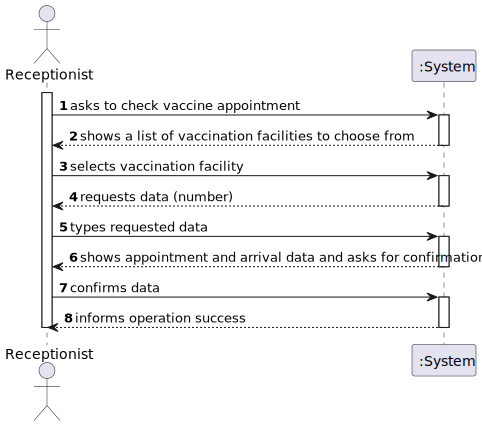
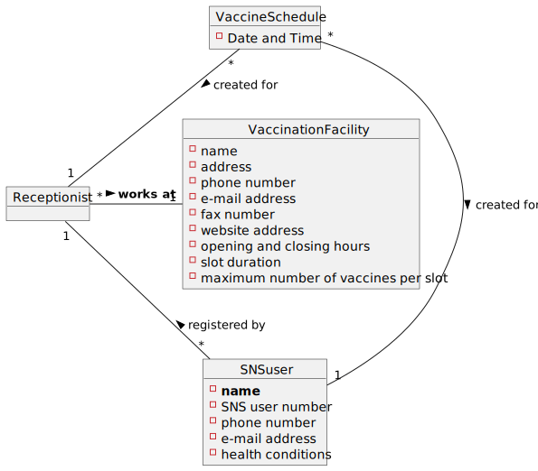
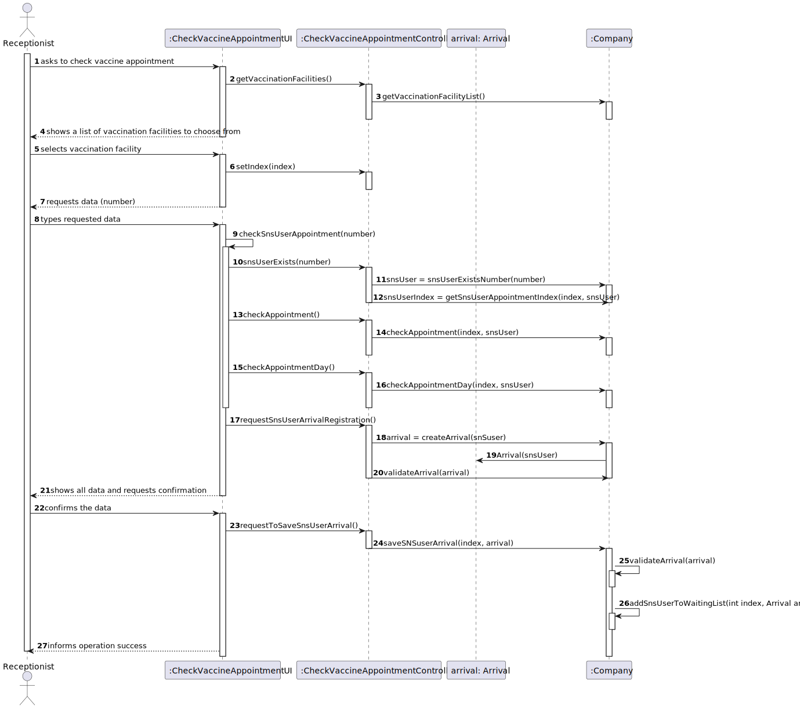

# US 004 - to register the arrival of an SNS user to take the vaccine

## 1. Requirements Engineering

### 1.1. User Story Description

As a receptionist at a vaccination center, I want to register the arrival of an SNS user
to take the vaccine.

### 1.2. Customer Specifications and Clarifications 

**From the specifications document:**

>[..] The receptionist asks the SNS user for his/her SNS user number and
confirms that he/she has the vaccine scheduled for the that day and time. If the information is
correct, the receptionist acknowledges the system that the user is ready to take the vaccine. Then,
the receptionist should send the SNS user to a waiting room where (s)he should wait for his/her
time.

**From the client clarification:**

>**Question:** How early/late can a user get to the vaccination center in order to be eligible to take the vaccine?
>Example: If a user has an appointment scheduled to 4PM, it does not make sense to be eligible if he tries to check in at 11AM. How long is this time limit?
>
> **Answer:** _Not Yet Provided._
> 
> (_Group 41_)

>**Question:** What are the attributes needed in order to register the arrival of an SNS user to a vaccination center?
> 
> **Answer:** The time of arrival should be registered.
> 
> (_Group 63_)
 
>**Question:** Should a receptionist register the arrival of an SNS user immediately when he arrives at the vaccination center or only after the receptionist confirms that the respective user has a vaccine schedule for that day and time?
> 
> **Answer:** The receptionist registers the arrival of an SNS user only after confirming that the user has a vaccine scheduled for that day and time.
> 
> (_Group 63_)

>**Question:** When the SNS user number is introduced by the receptionist and the system has no appointment for that SNS user number, how should the system proceed?
> 
> **Answer:** The application should present a message saying that the SNS user did not schedule a vaccination.
> 
> (_Group 10_)

>**Question:** What's the capacity of the waiting room?
>
>**Answer**: The waiting room will not be registered or defined in the system. The waiting room of each vaccination center has the capacity to receive all users who take the vaccine on given slot.
> 
> (_Group --_)

>**Question:** Respectively to US04, after the receptionist registers the SNS User's arrival at the Vaccination Center, the system creates the list that will be available for the Nurse to view, correct?
>
>**Answer:** The nurse checks the list (of SNS users in the waiting room) in US05.
> 
> (_Group 07_)

>**Question:** In this user story, the receptionist registers the arrival of an SNS User. Does the receptionist choose the center she works at during login like the nurse?
> 
> **Answer:** To start using the application, the receptionist should first select the vaccination center where she is working. The receptionists register the arrival of an SNS user at the vaccination center where she is working.
> 
> (_Group 41_)

>**Question:** Regarding US04, the attribute "arrival time" should be considered to let the user enter the waiting room. For example, a user that arrives 40 minutes after his appointment won't be allowed to enter the center, and another who only arrives 10 minutes late May proceed. If so, how much compensation time should we provide to the user.
>
>**Answer:** In this sprint we are not going to address the problem of delays. All arriving users are attended and registered by the receptionist.
> 
> (_Group 13_)

>**Question:** The nurse must have the possibility to choose which center she wants to register the SNS user's arrival every time she uses this feature, or should we make the nurse pick a center after they log in?
>
>**Answer:** To start using the application, the nurse should first select the vaccination center where she is working.
> 
> (_Group 10_)

>**Question:** When the receptionist registers a SNSUser arrival, should we validate that the vaccination center where the SNS user arrives is the same as where the receptionist is currently working? If so, should we allocate receptionists to vaccination centers, i.e., ask the receptionist which vaccination center is she currently working at?
>
>**Answer:** To start using the application, the receptionist should first select the vaccination center where she is working. The receptionists register the arrival of an SNS user at the vaccination center where she is working.
> 
> (_Group 78_)
### 1.3. Acceptance Criteria

**AC01:** No duplicate entries should be possible for the same SNS user on the same day or vaccine period.

### 1.4. Found out Dependencies

This US depends on US001 since an SNS User must have scheduled a vaccination in order for it to be verified by the receptionist.

### 1.5 Input and Output Data

- **Selected Data**
  - Vaccination Facility

- **Typed Data**
  - SNS User number

- **Output Data**
  - Verification of (in)existing vaccination "appointment".
  - (In)Success of operation.

### 1.6. System Sequence Diagram (SSD)

*Insert here a SSD depicting the envisioned Actor-System interactions and throughout which data is inputted and outputted to fulfill the requirement. All interactions must be numbered.*

### 1.7 Other Relevant Remarks

*Use this section to capture other relevant information that is related with this US such as (i) special requirements ; (ii) data and/or technology variations; (iii) how often this US is held.* 

## 2. OO Analysis

### 2.1. Relevant Domain Model Excerpt 
*In this section, it is suggested to present an excerpt of the domain model that is seen as relevant to fulfill this requirement.* 

### 2.2. Other Remarks

*Use this section to capture some additional notes/remarks that must be taken into consideration into the design activity. In some case, it might be useful to add other analysis artifacts (e.g. activity or state diagrams).* 

## 3. Design - User Story Realization 

### 3.1. Rationale

**The rationale grounds on the SSD interactions and the identified input/output data.**

| Interaction ID   | Question: Which class is responsible for...  | Answer                            | Justification (with patterns)                                                                                     |
|:-----------------|:---------------------------------------------|:----------------------------------|:------------------------------------------------------------------------------------------------------------------|
| Step 1  		       | ... interacting with the user?               | CheckVaccineAppointmentUI         | **Pure Fabrication:** there is no reason to assign this responsibility to any existing class in the Domain Model. |
|                  | ... coordinating the US?                     | CheckVaccineAppoinmentController  | **Controller**                                                                                                    |
| Step 2  		       |                                              |                                   |
| Step 3  		       | ... saving the input data?							            | CheckVaccineAppointmentController | **Controller**                                                                                                    |
| Step 4  		       | n/a							                                   |                                   |                                                                                                                   |
| Step 5  		       | 	... saving the input data?						            | CheckVaccinationAppointmentUI     | **Pure Fabrication:** theres no reason to assign this responsibility to any existing class in the Domain Model.   |
|                  | ... instantiating a new arrival?             | Company                           |                                                                                                                   |
| Step 6  		       | ... validating the data locally?						       | Arrival                           | **IE:** knows its own data.                                                                                       |              
|                  | ... validating the data globally?            | Company                           | **IE:** knows all the VaccinationAppointment objects.                                                             |
| Step 7  		       | .. saving the SNS User arrival?							       | Company                           | **IE:** adopts/ records all the Arrival objects.                                                                  |
|                  | ... adding the SNS User to the waiting room? | Company                           | **IE:** adopts/records all the VaccineAdministration objects.                                                     |
| Step 8  		       | ... informing the operation success?							  | CheckVaccinationAppointmentUI     | **IE:** responsible for user interaction.                                                                         |

### Systematization ##

According to the taken rationale, the conceptual classes promoted to software classes are: 

 * Company
 * Arrival

Other software classes (i.e. Pure Fabrication) identified: 
 * CheckVaccinationAppointmentUI  
 * CheckVaccinationAppointmentController

## 3.2. Sequence Diagram (SD)

*In this section, it is suggested to present a UML dynamic view stating the sequence of domain related software objects' interactions that allows to fulfill the requirement.* 

## 3.3. Class Diagram (CD)

*In this section, it is suggested to present a UML static view representing the main domain related software classes that are involved in fulfilling the requirement as well as and their relations, attributes and methods.*

