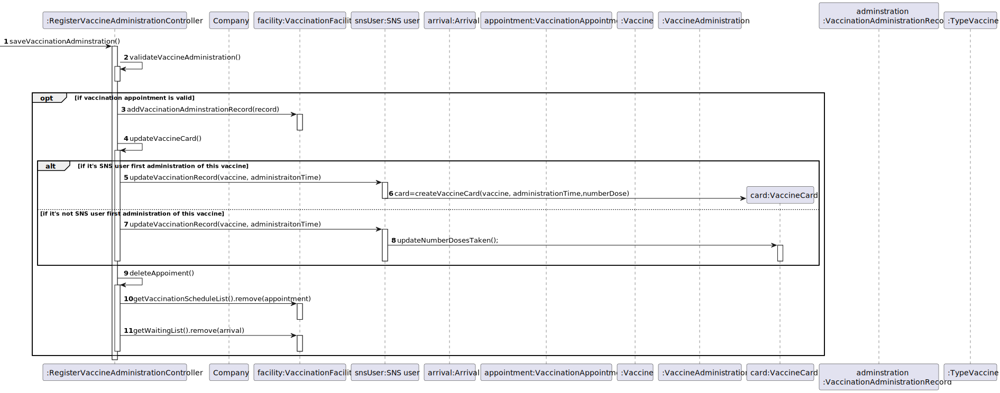

# US 008 - to record the administration of a vaccine to a SNS user

## 1. Requirements Engineering

### 1.1. User Story Description

*As a nurse, I want to record the administration of vaccine to a SNS user.*

### 1.2. Customer Specifications and Clarifications 

**From Project Description document**

> At any time, a nurse responsible for administering the vaccine will use the application **to check the
list of SNS users that are present in the vaccination center** to take the vaccine and will call one SNS
user to administer him/her the vaccine. Usually, the **user that has arrived firstly will be the first one**
to be vaccinated (like a FIFO queue). However, sometimes, due to operational issues, that might not
happen. The **nurse checks the user info and health conditions in the system and in accordance with
the scheduled vaccine type, and the SNS user vaccination history**, (s)he **gets system instructions
regarding the vaccine to be administered (e.g.: vaccine and respective dosage considering the SNS
user age group)**. After giving the vaccine to the user, each nurse registers the event in the system,
more precisely, **registers the vaccine type (e.g.: Covid-19), vaccine name/brand (e.g.: Astra Zeneca,
Moderna, Pfizer), and the lot number used**. Afterwards, the **nurse sends the user to a recovery room,
to stay there for a given recovery period** (e.g.: 30 minutes). If there are no problems, after the given
recovery period, the user should leave the vaccination center. The **system should be able to notify
(e.g.: SMS or email) the user that his/her recovery period has ended**.

 

**From Client Forum - Requirements Clarification**

>- **Question:**
    -the CSV file only contains information about SNS users of if the CSV file may also contain some information about employees from that vaccination center.
>- **Answer:** The CSV file only contains information about SNS users

>- **Question:**
    -In US 08 says: "At the end of the recovery period, the user should receive a SMS message informing the SNS user that he can leave the vaccination center." How should the SNS user receive and have access to the SMS message?
>- **Answer:** A file named SMS.txt should be used to receive/record the SMS messages. We will not use a real word service to send SMSs.

>- **Question:**
    -Previously the client answered that: \
    1. The nurse selects a SNS user from a list.\
    2. Checks user's Name, Age and Adverse Reactions registered in the system.\
    However, our group has five members and the US07: Register an adverse reaction is not obligatory to be implemented. So, with this in mind we would like to know if we, in step 2, should only show the Name and the Age or other information.
>- **Answer:** If your team does not implement US7, then you should show a message saying "No Adverse Reactions registered in the system".

>- **Question:**
    -I would like some clarification on the following points:\
    1. Is the nurse responsible for registering in the system the recovery period?\
    2. If there are no adverse reactions detected/registered, after the given recovery period, the system notifies the user that his/her recovery period has ended, right?\
    3. If there are adverse reactions detected/registered, the system should not do anything additional?\
>- **Answer:** \
   1- No. The recovery period starts automatically after registering the administration of a given vaccine.\
   2 and 3- US7 and US 8 are independent user stories.

>- **Question:**
    -As we can read in Project Description, the vaccination flow follows these steps:\
    1. Nurse calls one user that is waiting in the waiting room to be vaccinated;\
    2. Nurse checks the user's health data as well as which vaccine to administer;\
    3. Nurse administers the vaccine and registers its information in the system.\
    The doubt is: do you want US08 to cover steps 2 and 3, or just step 3?
>- **Answer:**\
  1-The nurse selects a SNS user from a list.\
  2-Checks user's Name, Age and Adverse Reactions registered in the system.\
  3-Registers information about the administered vaccine.

>- **Question:**
    -I would like to know some clarifications about the following points:\
    1- The system displays the list of possible vaccines to be administered (considering the age group of the user); then the nurse selects the dose she is going to administer and gets information about the dosage. But wouldn't it be more correct, since the system knows the vaccination history, in other words, if the user has already take x dose(s) of that vaccine, to simply show the dose and the respective dosage and not ask for the nurse to arbitrarily select it?\
    2- After giving the vaccine to the user, how should the nurse register the vaccine type? by the code?
>- **Answer:**\
   1- If it is the first dose, the application should show the list of possible vaccines to be administered. If is is not a single dose vaccine, when the SNS user arrives to take the vaccine, the system should simply show the dose and the respective dosage.\
   2- A vaccine is associated with a given vaccine type. Therefore, there is no need to register the vaccine type.\
   Moreover, the nurse should also register the vaccine lot number (the lot number has five alphanumeric characters an hyphen and two numerical characters (example: 21C16-05)).

>- **Question:**
    -Supposing that the SNS user has already received a dose of a given vaccine type (for example, COVID-19), the user can only receive the same vaccine or a different one with the same vaccine type?
>- **Answer:**
   -The SNS user can only receive the same vaccine.\
   Related information:\
   A SNS user is fully vaccinated when he receives all doses of a given vaccine.\
   A SNS user that has received a single-dose vaccine is considered fully vaccinated and will not take more doses.\
   A SNS user that is fully vaccinated will not be able to schedule a new vaccine of the type for which he is already fully vaccinated.

>- **Question:**
    -To access the user info - scheduled vaccine type and vaccination history -, should the nurse enter user's SNS number?
>- **Answer:**
    -The nurse should select a SNS user from a list of users that are in the center to take the vaccine.
### 1.3. Acceptance Criteria

**AC01-** the lot number has five alphanumeric characters an hyphen and two numerical characters./
### 1.4. Found out Dependencies

*Identify here any found out dependency to other US and/or requirements.*

- No dependencies were found

### 1.5 Input and Output Data
**Input Data:**\
**- Typed data:**
- Recovery period
- Lot number

**- Selected data:**

- Vaccination facilities
- Vaccines
- SNS user information
- Vaccination Appoiment
- 

**Output Data:**

- Saved list of SNS users
- (In)Success of the operation

### 1.6. System Sequence Diagram (SSD)

 

### 1.7 Other Relevant Remarks

There are some similarities to US 9 regarding the need to validate similar data, for exemple address and phone number. Thus needing to use the Validate class with methods to validate such data 
.
## 2. OO Analysis

### 2.1. Relevant Domain Model Excerpt 

 

### 2.2. Other Remarks

-Similar feature, only difference is in this case the user doesn't type the data of the SNS user on the console.\
-There are some similarities to US 3 and US 10 regarding the need to generate a password.
## 3. Design - User Story Realization 

### 3.1. Rationale

| Interaction ID | Question: Which class is responsible for...                    | Answer                  | Justification (with patterns)                                                                                                                                                                                                                                                    |
|:---------------|:---------------------------------------------------------------|:------------------------|:---------------------------------------------------------------------------------------------------------------------------------------------------------------------------------------------------------------------------------------------------------------------------------|
| Step 1  		     | 			... interacting with the actor?				                         | AddSNSfromCSVUI         | **Pure Fabrication:** there is no reason to assign this responsibility to any existing class in the Domain Model                                                                                                                                                                 |
|                | ..coordinating the US?                                         | AddSNSfromCSVController | **Controller**                                                                                                                                                                                                                                                                   |
| Step 2 		      | 							                                                        |                         |                                                                                                                                                                                                                                                                                  |
| Step 3 		      | 		...saving the typed data?						                              | AddSNSfromCSVUI         | **Pure Fabrication:** theres no reason to assign this responsibitly to any existing class in the Domain Model                                                                                                                                                                    |
| Step 4         | ...reading the file?                                           | AddSNSfromCSVUI         | **IE** knows the file address                                                                                                                                                                                                                                                    |
|                | ...transfer the user data on the file in the UI to the domain? | SNSuserDTO              | **DTO:** When there is so much data to transfer, it is better to opt by using a DTO in order to reduce coupling between UI and domain                                                                                                                                            |
|                | ... instantiating a new SNS user?                              | MapperSNSuser           | **Creator** **HC+LC** By the application of the Creator (R1) it would be the "Company". But, by applying HC + LC to the "Company", this delegates that responsibility to the mapper                                                                                              |
|                | ... validating all data of a SNS user?                         | AddSNSfromCSVUI         | **IE:** knows all data of the SNS user                                                                                                                                                                                                                                           |
| Step 5         | ... validating all data (global validation)?                   | Company                 | **IE:** knows all the SNS Users                                                                                                                                                                                                                                                  |
| 		             | 		... generating the password?					                            | Utils                   | **IE** and **Pure Fabrication**: Company has all the required information and means to generate the password (IE). However, to avoid code duplication (cf. US10 AND US03) this responsibility might be assign to a common and shared artificial class, specialized in this task. |
| 		             | 			... saving the SNS user?				                                | Company                 | **IE:** Knows all SNS users                                                                                                                                                                                                                                                      |
|                | ... creating and validating login credentials?                 | AuthFacade              | **IE:** login management is responsibility of the respective external component whose point of interaction is through the class "AuthFacade",check documentation for more information                                                                                            |
| Step 6  		     | 			... informing operation success?				                        | AddSNSfromCSVUI	        | **IE:** is responsible for user interactions                                                                                                                                                                                                                                     |           

### Systematization ##

According to the taken rationale, the conceptual classes promoted to software classes are:
 * SNS user

Other software classes (i.e. Pure Fabrication) identified: 
 * AddSNSfromCSVUI  
 * AddSNSfromCSVController
 * SNSuserDTO 
 * MapperSNSuser
 * Company
 * Utils

Other software classes of external systems/components:
 * AuthFacade

## 3.2. Sequence Diagram (SD)

\
\

**US_SD_GetVaccineInfo**\
\

\
**US_SD_CreateRecord**\
\

**US_SD_SaveAdministration**\
\

\
**US_SD_CreateAndSendSMS**\
\

## 3.3. Class Diagram (CD)

 

