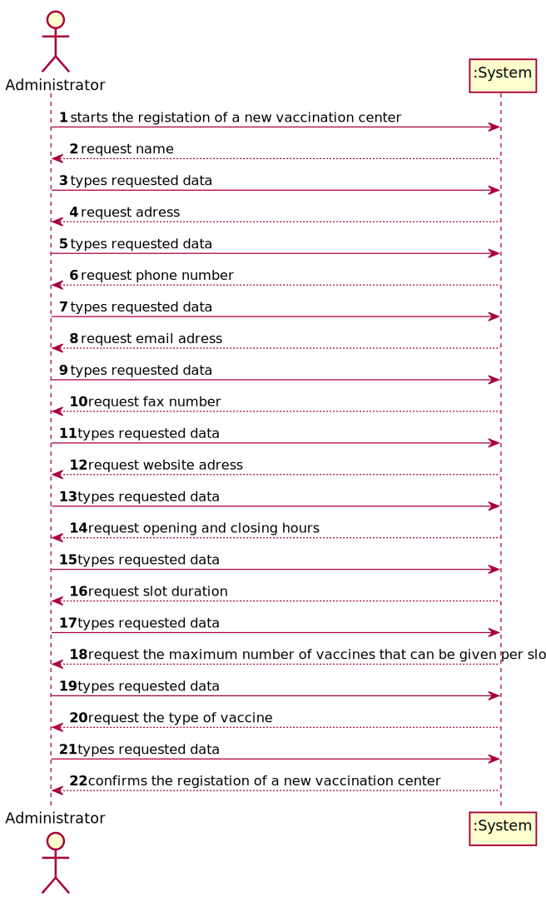
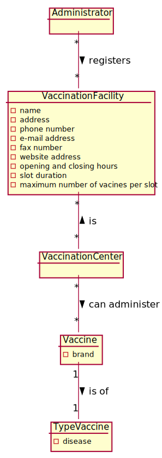
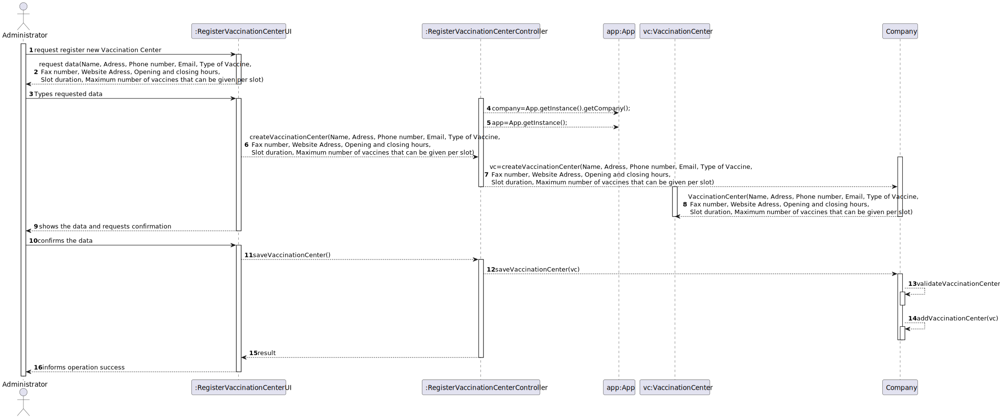
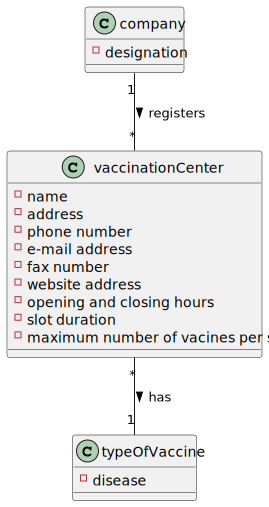

# US9 - To create a Task 

## 1. Requirements Engineering

### 1.1. User Story Description

As an Administrator, I want to register a vaccination center to respond to a certain pandemic.

### 1.2. Customer Specifications and Clarifications 

**From the specifications document:**

>	Each vaccination center is characterized by a name, an address, a phone number, an e-mail address, a
fax number, a website address, opening and closing hours, slot duration (e.g.: 5 minutes) and the
maximum number of vaccines that can be given per slot. 

>   Vaccination centers can only administer vaccines of a single type. 

**From the client clarifications:**

> **Question:** 
>  
> **Answer:** 

### 1.3. Acceptance Criteria

* **AC1:** All required fiels must be filled in.

### 1.4. Found out Dependencies

* There is a dependency to US9

### 1.5 Input and Output Data

**Input Data:**

* Typed data:
	* a name 
	* an adress 
	* a phone number
	* an email adress
	* a fax number
	* a website adress
	* opening and closing hours
	* slot duration
	* maximum number of vaccines that can be given per slot
	
* Selected data:
	* Vaccine Type 

**Output Data:**

* Success of the operation

### 1.6. System Sequence Diagram (SSD)

**Other alternatives might exist.**

## 2. OO Analysis

### 2.1. Relevant Domain Model Excerpt 

### 2.2. Other Remarks

n/a

## 3. Design - User Story Realization 

### 3.1. Rationale

**SSD - Alternative 1 is adopted.**

| Interaction ID | Question: Which class is responsible for... | Answer                      | Justification (with patterns)  |
|:-------------  |:--------------------- |:----------------------------|:---------------------------- |
| Step 1  		 |	... interacting with the actor? | RegisterVaccinationCenterUI |             |
| 			  		 |	... coordinating the US? | VaccinationCenterController        |                            |

## 3.2. Sequence Diagram (SD)

## 3.3. Class Diagram (CD)

