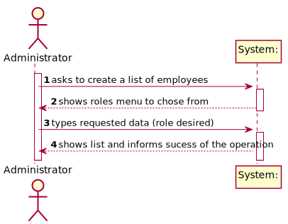
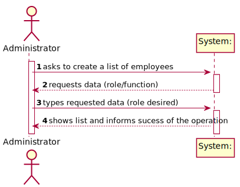
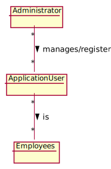
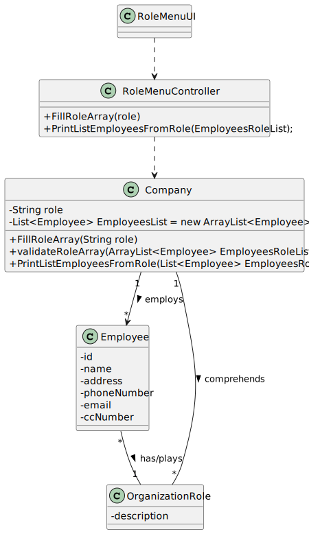

# US11 - Get a list of employees with a given role

## 1. Requirements Engineering

*In this section, it is suggested to capture the requirement description and specifications as provided by the client as well as any further clarification on it. It is also suggested to capture the requirements acceptance criteria and existing dependencies to other requirements. At last, identify the involved input and output data and depicted an Actor-System interaction in order to fulfill the requirement.*

### 1.1. User Story Description

As an adminstrator, I want to get a list of Employees with a given funtion/role.

### 1.2. Customer Specifications and Clarifications 

> **Question**: Should we give the user the possibility of listing employees from more than 1 role?
> 
> **Answer**: The Administrator should select a given role and all employees associated with the selected role should be listed.

>  **Question**: Should the list be sorted in any specific way(for example alphabetical name order) or should we give the option to sort by other characteristics?
>
> **Answer**:For now I just want to get a list of employees without considering the order of presentation.

> **Question**: Besides the name of the employee, what other attributes do we need to show on the list? Can we show every single attribute, including password and username?
> 
> **Answer**: The application should present all Employee attributes.
Password is not an Employee attribute.

### 1.3. Acceptance Criteria

* There is no acceptance criteria specified for this US.

### 1.4. Found out Dependencies

* There is a dependency to "US010 Register an employee" since there must be registered employees to create a list  of employees

### 1.5 Input and Output Data

**Input data:**

* Typed data:
   * Role
* Selected data:
   * Role

**Output data:**

* List of the employees of the chosen role/function
* Sucess or insucess of the operation

### 1.6. System Sequence Diagram (SSD)

**Alternative 1**

**Alternative 2**

### 1.7 Other Relevant Remarks

*Use this section to capture other relevant information that is related with this US such as (i) special requirements ; (ii) data and/or technology variations; (iii) how often this US is held.* 

## 2. OO Analysis

### 2.1. Relevant Domain Model Excerpt

### 2.2. Other Remarks

*Use this section to capture some aditional notes/remarks that must be taken into consideration into the design activity. In some case, it might be usefull to add other analysis artifacts (e.g. activity or state diagrams).* 

## 3. Design - User Story Realization 

### 3.1. Rationale

**The rationale grounds on the SSD interactions and the identified input/output data.**

| Interaction ID | Question: Which class is responsible for... | Answer             | Justification (with patterns)                                                                                    |
|:-------------  |:--------------------------------------------|:-------------------|:-----------------------------------------------------------------------------------------------------------------|
| Step 1  		 | 			... interacting with the actor?				      | RoleMenuUI         | **Pure Fabrication**: there is no reason to assign this responsibility to any existing class in the Domain Model |
|            | ... coordinating the US?                    | RoleMenuController | **Controller**                                                                                                   |
| Step 2  		 | 		...filling the Role Array?					           | Company            |                                                                                                                  |
|            | ...validate the Role Array ?                | Company            |                                                                                                                  |
| Step 3  		 | 	...informing operation success?						      | RoleMenyUI         | **IE**: is responsible for user interactions                                                                     |
| Step 4  		 | 							                                     |                    |                                                                                                                  |
| Step 5  		 | 	 					                                     |          |                                                                                                                  |
| Step 6  		 | 							                                     |                    |                                                                                                                  |              
| Step 7  		 | 							                                     |                    |                                                                                                                  |
| Step 8  		 | 							                                     |                    |                                                                                                                  |
| Step 9  		 | 							                                     |                    |                                                                                                                  |
| Step 10  		 | 							                                     |                    |                                                                                                                  |  

### Systematization ##

According to the taken rationale, the conceptual classes promoted to software classes are: 

 * Employee
 * Company
 * App
 * User

Other software classes (i.e. Pure Fabrication) identified: 
 * RoleMenuUI  
 * RoleMenuController

## 3.2. Sequence Diagram (SD)

*In this section, it is suggested to present an UML dynamic view stating the sequence of domain related software objects' interactions that allows to fulfill the requirement.* 

 
## 3.3. Class Diagram (CD)

*In this section, it is suggested to present an UML static view representing the main domain related software classes that are involved in fulfilling the requirement as well as and their relations, attributes and methods.*

