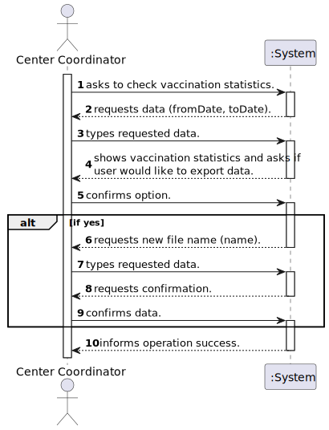

# US 015 - To check and export vaccination statistics

## 1. Requirements Engineering

### 1.1. User Story Description

As a center coordinator, I intend to check and export vaccination statistics. I want to export, to csv file, the total number of fully vaccinated user per day.

### 1.2. Customer Specifications and Clarifications 

>**Question:** "In this US should the Center Coordinator check and export the Vaccination Statistics of the Center where he/she works at or should just check and export the Vaccination Statistics of all centers?"
>
>**Answer:** The center coordinator can only export statistics from the vaccination center that he coordinates.
> 
> (_Group 02_)

>**Question:** "1-Should the user introduce the name of the file intended to export the vaccination statistics ?
2-Are the vaccination statistics referring only to the fully vaccinated users or referring to something more ?"
>
>**Answer:**
1- The user should introduce the name of the file.
2- Only to fully vaccinated users.
> 
> (_Group 09_)

>**Question:** "Is the exportation of the CSV file that contains the total number of fully vaccinated users per day, the only feature that needs to be implemented in code, for US15? "
>
>**Answer:** Yes.
> 
> (_Group 63_)

>**Question:** "1- When exporting vaccination statistics,do we export the data from all days available in the system or does the center coordinator chooses the time interval? 2-Is there any kind of format our exported data should follow?"
>
>**Answer:** 1- The user should define a time interval (two dates).
2- Data format: date; number of fully vaccinated user. 
> 
> (_Group 07_)

 

### 1.3. Acceptance Criteria

There are no known acceptance criteria.

### 1.4. Found out Dependencies

This US depends on US 008 as the vaccination of an SNS User has to be recorded by a nurse in order to be integrated in the system.

### 1.5 Input and Output Data

- **Typed Data:**
  - fromDate
  - toDate
  - file name

- **Output Data:**
    - .csv File containing vaccination statistics.
    - (In)Success of the operation

### 1.6. System Sequence Diagram (SSD)

*Insert here a SSD depicting the envisioned Actor-System interactions and throughout which data is inputted and outputted to fulfill the requirement. All interactions must be numbered.*

### 1.7 Other Relevant Remarks

*Use this section to capture other relevant information that is related with this US such as (i) special requirements ; (ii) data and/or technology variations; (iii) how often this US is held.* 

## 2. OO Analysis

### 2.1. Relevant Domain Model Excerpt 
*In this section, it is suggested to present an excerpt of the domain model that is seen as relevant to fulfill this requirement.* 

### 2.2. Other Remarks

*Use this section to capture some additional notes/remarks that must be taken into consideration into the design activity. In some case, it might be usefully to add other analysis artifacts (e.g. activity or state diagrams).* 

## 3. Design - User Story Realization 

### 3.1. Rationale

**The rationale grounds on the SSD interactions and the identified input/output data.**

| Interaction ID | Question: Which class is responsible for... | Answer | Justification (with patterns) |
|:---------------|:--------------------------------------------|:-------|:------------------------------|
| Step 1  		     | 							                                     |        |                               |
| Step 2  		     | 							                                     |        |                               |
| Step 3  		     | 							                                     |        |                               |
| Step 4  		     | 							                                     |        |                               |
| Step 5  		     | 							                                     |        |                               |
| Step 6  		     | 							                                     |        |                               |              
| Step 7  		     | 							                                     |        |                               |
| Step 8  		     | 							                                     |        |                               |
| Step 9  		     | 							                                     |        |                               |
| Step 10  		 | 							                                     |        |                               |  

### Systematization ##

According to the taken rationale, the conceptual classes promoted to software classes are: 

 * Class1
 * Class2
 * Class3

Other software classes (i.e. Pure Fabrication) identified: 
 * xxxxUI  
 * xxxxController

## 3.2. Sequence Diagram (SD)

*In this section, it is suggested to present a UML dynamic view stating the sequence of domain related software objects' interactions that allows to fulfill the requirement.* 

## 3.3. Class Diagram (CD)

*In this section, it is suggested to present a UML static view representing the main domain related software classes that are involved in fulfilling the requirement as well as and their relations, attributes and methods.*

# 4. Tests 
*In this section, it is suggested to systematize how the tests were designed to allow a correct measurement of requirements fulfilling.* 

**_DO NOT COPY ALL DEVELOPED TESTS HERE_**

**Test 1:** Check that it is not possible to create an instance of the Example class with null values. 

	@Test(expected = IllegalArgumentException.class)
		public void ensureNullIsNotAllowed() {
		Exemplo instance = new Exemplo(null, null);
	}

*It is also recommended to organize this content by subsections.* 

# 5. Construction (Implementation)

*In this section, it is suggested to provide, if necessary, some evidence that the construction/implementation is in accordance with the previously carried out design. Furthermore, it is recommended to mention/describe the existence of other relevant (e.g. configuration) files and highlight relevant commits.*

*It is also recommended to organize this content by subsections.* 

# 6. Integration and Demo 

*In this section, it is suggested to describe the efforts made to integrate this functionality with the other features of the system.*

# 7. Observations

*In this section, it is suggested to present a critical perspective on the developed work, pointing, for example, to other alternatives and or future related work.*

