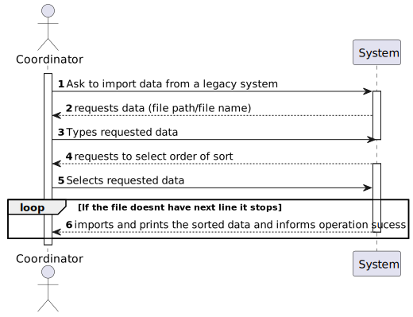
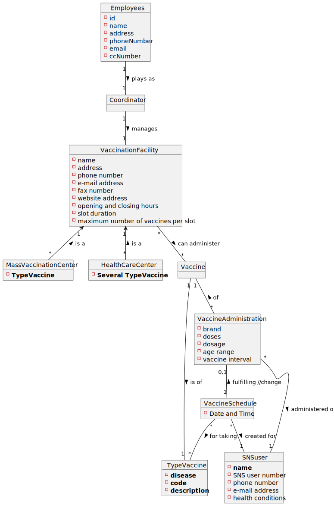
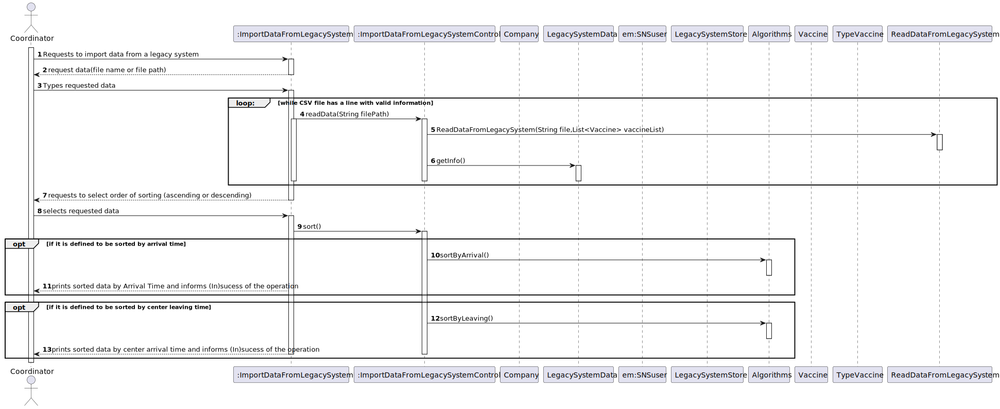
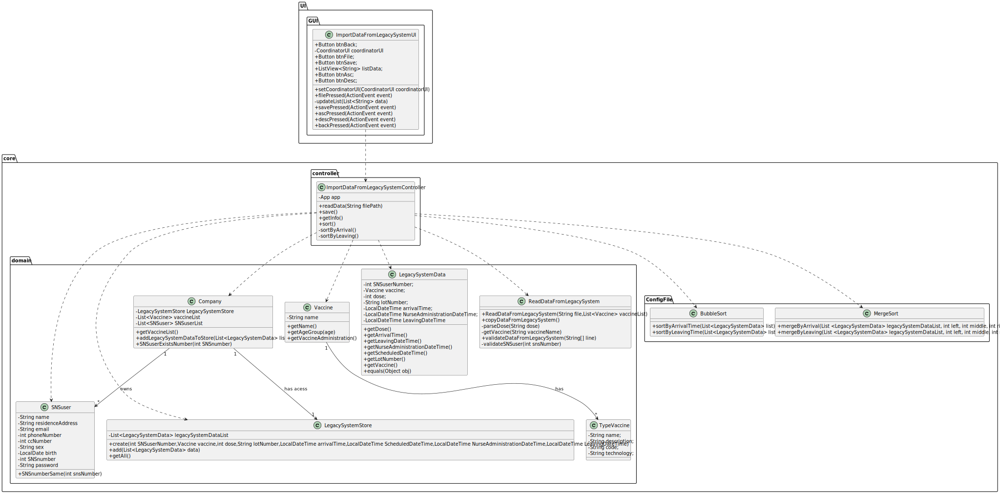

# US017 - Import data from a legacy system that was used in the past to manage centers

## 1. Requirements Engineering

### 1.1. User Story Description

As a center coordinator, I want to import data from a legacy system that was used in the past to manage centers. The imported data
should be presented to the user sorted by arrival time or by the center leaving time. The name of the SNS user and the vaccine type 
Short Description attribute should also be presented to the user.

### 1.2. Customer Specifications and Clarifications

> **Question**: In the Sprint D requirements is stated that two sorting algorithms should be implemented and that the imported data should be sorted by arrival time or center leaving time. Should each algorithm be capable of both sortings or is one of the algorithms supposed to do one (e.g. arrival time) and the other the remaining sorting criteria (e.g. leaving time)?"
>
> **Answer**:  Each algorithm should be capable of doing both sortings. The application should be prepared to run both algorithms. The algorithm that will be used to sort data should be defined in a configuration file.

> **Question**:"It should be an option to choose to either sort by arrival time or by the center leaving time?"
> 
> **Answer**: The user can choose to sort by arrival time or by the center leaving time.

> **Question**: "I was analysing the csv file that should be imported for US17 (the one that is in moodle), I noticed that the date attributes are written like this 5/30/2022 I thought that the date format should be DD/MM/YYYY. I also noticed, that the time is written like this, 9:43, I also thought that the time format should be written like this HH:MM, (in this case it would be 09:43). Are the date and time formats diferent for US17?"
>
> **Answer**: That file is from a legacy system, that uses a different date and time format. The date and time should be converted when loading the data into the application that we are developing.

> **Question**: "I noticed that some postal codes in the address does not follow the format of XXXX-YYY. For example some of them are XXXX-Y. Are we supposed to be able to load those users as well?"
>
> **Answer**: Yes.

> **Question**: "You already have clarified that when uploading a file from a legacy system the application should check if the SNS Users are already registered and if not, we should register them using US 014. How exactly do you want this to proceed, in case there aren't registered users, should the application ask the center coordinator to select the file with the users data to be uploaded?"
> 
> **Answer**:  US14 and US17 are two different features of the system. In US17, if the SNS user does not exist in the system, the vaccination of this SNS user should not be loaded. The system should continue processing the CSV file until all vaccinations are processed.

### 1.3. Acceptance Criteria

**AC**: Two sorting algorithms should be implemented (to be chosen manually by the coordinator), and worst-case time complexity of each algorithm should be documented in the application user manual
(in the annexes) that must be delivered with the application. The center coordinator must be able to chose the file that is to be uploaded.

### 1.4. Found out Dependencies

* There is a dependency to "US014 load a set of users from a CSV file" since the registration of the users must be done in order to save their vaccination record.
* There is a dependency to "US013 specify a new vaccine and its administration process" so their vaccination record is associated with existing vaccines in the system.

### 1.5 Input and Output Data

**Input data:**

* Typed data:
    * File path
* Selected data:
    * Operation selected (import data from legacy system)
    * Order of sorting (ascending or descending)

**Output data:**

* Sorted file (in an ascending or descending order)

### 1.6. System Sequence Diagram (SSD)

### 1.7 Other Relevant Remarks

* None

## 2. OO Analysis

### 2.1. Relevant Domain Model Excerpt

### 2.2. Other Remarks

* None

## 3. Design - User Story Realization

### 3.1. Rationale

**The rationale grounds on the SSD interactions and the identified input/output data.**

| Interaction ID | Question: Which class is responsible for...  | Answer                               | Justification (with patterns)                                                                                                                    |
|:---------------|:---------------------------------------------|:-------------------------------------|:-------------------------------------------------------------------------------------------------------------------------------------------------|
| Step 1  		     | 		... interacting with the actor?					       | ImportDataFromLegacySystemUI         | **Pure Fabrication**: there is no reason to assign this responsibility to any existing class in the Domain Model                                 |
|                | ... coordinating the US?                     | ImportDataFromLegacySystemController | **Controller**                                                                                                                                   |
| Step 2  		     | 						                                       |                                      |                                                                                                                                                  |
| Step 3  		     | 		... saving the typed data ?					           | ImportDataFromLegacySystemUI         | **Pure Fabrication**:  there is no reason to assign this responsibility to any existing class in the Domain Model                                |
| Step 4         |                                              |                                      |                                                                                                                                                  |
| Step 5  		     | 		... saving the selected data?					         | ImportDataFromLegacySystemUI         | **Pure Fabrication**:  there is no reason to assign this responsibility to any existing class in the Domain Model                                | 
| Step 6         | ... validating all data (global validation)? | Company                              | **IE:** knows all the SNS Users                                                                                                                  |

### Systematization ##

According to the taken rationale, the conceptual classes promoted to software classes are:

* ImportDataFromLegacySystemUI
* Company

Other software classes (i.e. Pure Fabrication) identified:

* ImportDataFromLegacySystemUI
* ImportDataFromLegacySystemController

## 3.2. Sequence Diagram (SD)

## 3.3. Class Diagram (CD)

